# FEMMEFLOW TRACKER 📆🩸🩸

### DEPLOYED APPLICATION: [FEMMEFLOW TRACKER 🩸](https://femmeflow-tracker-06bab98fd82a.herokuapp.com/)

**FemmeFlow Tracker** is an interactive and user-friendly Python-based application designed to empower women to better understand and manage their menstrual cycles. By providing insightful information, personalized recommendations, and health tips, this application aims to enhance well-being and support users in their menstrual health journey.

The application's core mission is to empower women by offering a dynamic blend of data-driven insights.
FemmeFlow Tracker stands as a reliable companion, providing invaluable assistance every step of the way.

Empowering Your Menstrual Health Journey

**➡️ OUR MAIN GOALS:**

- **Personalized Recommendations:** Tailored to your individual menstrual profile, the application provides personalized recommendations that encompass exercise tips, stress management tips, and more, enhancing your ability to manage your cycle effectively.

- **Empowering Health Tips:** Explore a treasure trove of health tips that extend beyond the conventional, offering proactive guidance to optimize your well-being during every phase of your menstrual cycle.

- **Future Projection:** FemmeFlow Tracker doesn't just help you in the present; it offers glimpses into the future by projecting fertile days and predicting the start dates of upcoming periods, allowing you to plan and prepare with confidence.

- **User-Centric Approach:** Backed by a commitment to user well-being, FemmeFlow Tracker places you at the center of the experience, ensuring that the application is not just informative but also intuitive and empathetic.

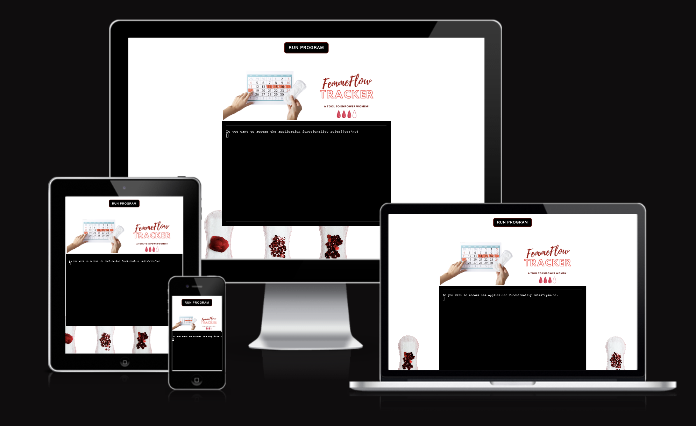
[Am I responsive?](https://ui.dev/amiresponsive?url=https://femmeflow-tracker-06bab98fd82a.herokuapp.com/)

---
## TABLE OF CONTENT 📖 📊

1. [FEATURES](#-features)
   - [LANDING PAGE: AN INVITING INTRODUCTION](#-landing-page-an-inviting-introduction)
   - [APPLICATION INTRODUCTION](#-application-introduction)
   - [WELCOMING PAGE AND USER'S NAME PROMPT](#-welcoming-page-and-users-name-prompt)
   - [ESSENTIAL INFORMATION GATHERING DISCLAIMER](#-essential-information-gathering-disclaimer)
   - [OPEN GOOGLE FORM PAGE](#-open-google-form-page)
   - [AUTOMATED EMAIL NOTIFICATIONS](#-automated-email-notifications)
   - [EMAIL COLECTION AND VALIDATION](#-email-colection-and-validation)
   - [FETCH USER DATA](#-fetch-user-data)
   - [OPTIONS TABLE](#-options-table)
      - [TABLE OVERVIEW](#-table-overview-)
      - [TABLE OPTION 1](#-table-option-1-)
      - [TABLE OPTION 2](#-table-option-2-)
      - [TABLE OPTION 3](#-table-option-3-)
      - [TABLE OPTION 4](#-table-option-4-)
      - [TABLE OPTION 5](#-table-option-5-)
      - [TABLE OPTION 6 ](#-table-option-6-)
      - [TABLE OPTION 7 ](#-table-option-7-)
      - [TABLE OPTION 8 ](#-table-option-8-)
   - [FEATURES LEFT TO IMPLEMENT](#-features-left-to-implement)
2. [UX DESIGN](#-ux-design)
   - [USER GOALS](#-user-goals)
   - [APPLICATION ADMIN GOALS](#-application-admin-goals)
   - [SCOPE](#-scope)
   - [STRUCTURE](#-structure)
   - [COLOUR SCHEME](#-colour-scheme)
   - [IMAGERY AND LANDING PAGE INTERFACE](#-imagery-and-landing-page-interface)
   - [RESPONSIVE DESIGN](#-responsive-design)
3. [TECHNOLOGIES USED](#-technologies-used)
   - [LANGUAGES USED](#-languages-used)
   - [FRAMEWORKS, LIBRARIES & PROGRAMS USED](#-frameworks-libraries--programs-used)
4. [TESTING](#-testing)
5. [DEVELOPMENT AND DEPLOYMENT PROCESS](#-development-and-deployment-process)
   - [CREATING A NEW REPOSITORY](#-creating-a-new-repository)
   - [LINK GOOGLE FORM TO GOOGLE SPREADSHEET](#-link-google-form-to-google-spreadsheet)
   - [CONNECT SPREADSHEET WITH PYTHON](#-connect-spreadsheet-with-python)
   - [GOOGLE SHEET SETUP TO SEND AUTOMATED EMAIL](#-google-sheet-setup-to-send-automated-email)
   - [DEPLOYING ON HEROKU](#-deploying-on-heroku)
6. [CREDITS](#-credits)
   - [LEARNING RESOURCES](#-learning-resources--)
   - [LEARNING VIDEOS](#-learning-videos--)
   - [DESIGN AND VISUALS](#-design-and-visuals--)
   - [README INSPIRATION](#-readme-inspiration--)
   - [PERSONAL JOURNEY AND INSPIRATION](#-personal-journey-and-inspiration--)

---
## ➡ FEATURES

Discover a range of features that provide personalized insights, health tips, and predictions, enhancing your well-being and menstrual health journey. Dive into the following capabilities that FemmeFlow Tracker offers:

### ➥ LANDING PAGE: AN INVITING INTRODUCTION
---
Step into the world of FemmeFlow Tracker through its captivating landing page. As you enter, you'll be greeted by a central black terminal. Atop this terminal window, a thoughtfully designed logo, crafted using Canva Premium, proudly presents the iconic FemmeFlow Tracker emblem. Just above the logo, a beckoning "Run Program" button entices you to embark on your journey.

Beneath the terminal, a white background image takes shape, portraying a tasteful arrangement of menstrual pads. This image, meticulously created using Canva Premium, seamlessly weaves into the application's theme, echoing the essence of menstrual health and comfort. With every element thoughtfully orchestrated, the landing page encapsulates the spirit of FemmeFlow Tracker – user-friendly, empowering, and attuned to your well-being.

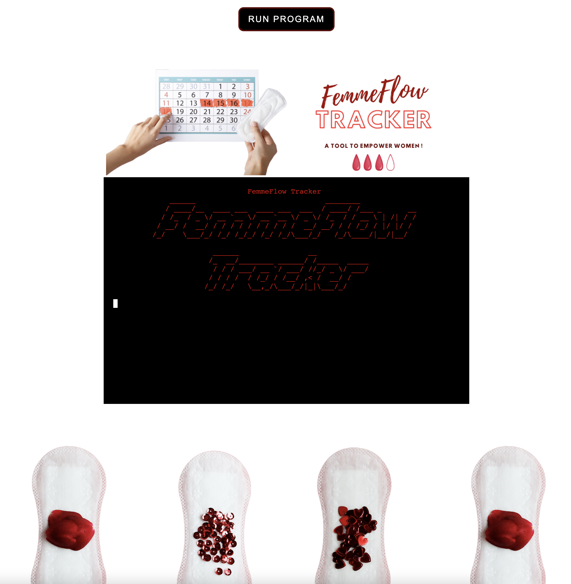

[BACK TO TABLE OF CONTENT 🔼 ](#table-of-content--)

### ➥ APPLICATION INTRODUCTION

The `introduction()` function serves as the initial interaction point between the user and the FemmeFlow Tracker application. Its purpose is to provide a warm and informative welcome to the user, setting the stage for their interaction with the application's features. Here's a breakdown of the introductory features:

#### ⤵️ Displaying application Name with animation ⤵️

- The function begins by invoking the `display_name()` function, which presents the application name "FemmeFlow Tracker" in ASCII art with an animation effect. 
- The `display_name()` function begins by defining the application name as "FemmeFlow Tracker" and generating the corresponding ASCII art using the "slant" font style from the pyfiglet library. To ensure the presentation's elegance, the function dynamically calculates the terminal width to center-align the text.


#### ⤵️ Access Application Functionality Rules ⤵️

- After displaying the application name, the user is prompted with a choice to access the application's functionality rules. 
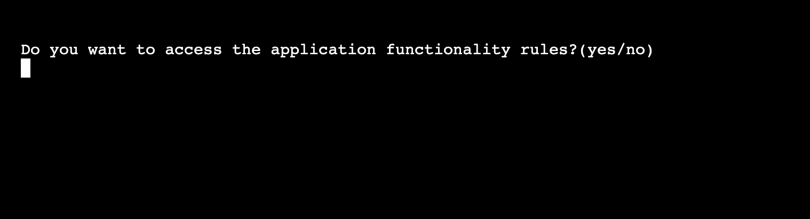

- If the user chooses to access the rules **("yes" input)**, the function clears the screen, and the `display_application_rules()` function is called to present the user with a clear understanding of how the application works. After the user is done with the rules they can press enter and they will be redirected to the welcoming message.
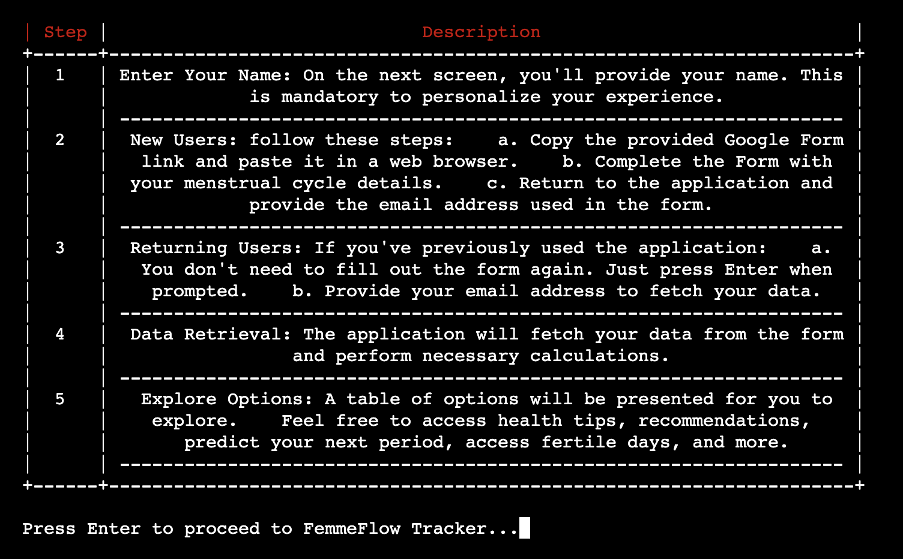

- If the user chooses not to access the rules **("no" input)**, the function clears the screen, and the application will them display the welcoming message. 

[BACK TO TABLE OF CONTENT 🔼 ](#table-of-content--)

### ➥ WELCOMING PAGE AND USER'S NAME PROMPT
---
- Following the display of the rules or if the user chooses not to access them, the function clears the screen again and proceeds to display a detailed welcome message and description of the FemmeFlow Tracker application's purpose. 
- This description highlights the application's capabilities, such as tracking the menstrual cycle, predicting the next period date, offering personalized recommendations, and providing health tips.
- The user is then prompted to enter their name. Input validation ensures that a non-empty name is provided before proceeding. This step adds a personalized touch to the user's experience and prepares the application to address them by name. 
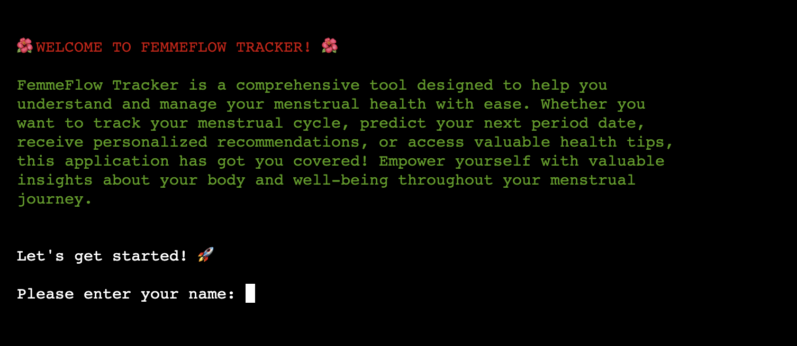
- After obtaining the user's name, the function clears the screen one final time and prepares for further interaction. This sets the stage for the user to engage with the application's features, armed with knowledge about its purpose and functionality.
- Throughout the function's execution, animation effects and color highlighting (using the Fore class from the colorama library) enhance the visual appeal and readability of the messages presented to the user.

By guiding the user through a visually engaging and informative introduction, the `introduction()` function establishes a welcoming and user-centric environment, encouraging users to explore the various features FemmeFlow Tracker has to offer.

[BACK TO TABLE OF CONTENT 🔼 ](#table-of-content--)

### ➥ ESSENTIAL INFORMATION GATHERING DISCLAIMER
---
The `display_prompt_message()` function and the subsequent user interaction steps collectively contribute to guiding the user through the process of providing essential information to utilize the FemmeFlow Tracker application. Here's a breakdown of this feature:

- **Display Prompt Message:** The `display_prompt_message()` function is responsible for presenting the user with a prompt message that informs them about the requirement to complete a form with essential information to use the application. The message emphasizes the importance of user input for optimal functionality. The message is visually enhanced by wrapping the text and displaying it in red using color formatting from the `colorama` library. The text is also animated for added visual interest.

- **User Interaction - Initial Prompt:** After displaying the prompt message, the application prompts the user with a question: `"Would you like to continue? (yes/no)"` This gives the user the choice to proceed with providing the necessary information or to opt out. The user's response is captured, and the screen is cleared for clarity.
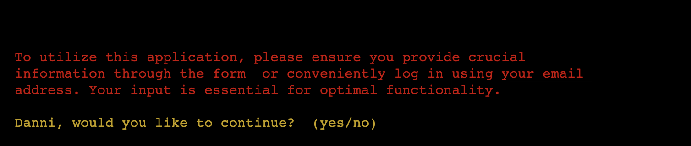

- **User Response Validation:** The user's response is then validated to ensure it matches either "yes" or "no." If the response is invalid, an error message is displayed in red, prompting the user to enter a valid response.


- **User's Decision - Proceed (Yes):** If the user's response is "yes," the `open_google_form()` function is invoked to facilitate the opening of the Google Form where the user can submit their data. The application then prompts the user to press Enter once they have submitted the data in the Google Form and are ready to proceed.

- **User's Decision - Do Not Proceed (No):** If the user's response is "no," the application informs the user that data submission is required for FemmeFlow Tracker to work effectively. The user is given the option to reconsider and proceed by submitting data in the Google Form.
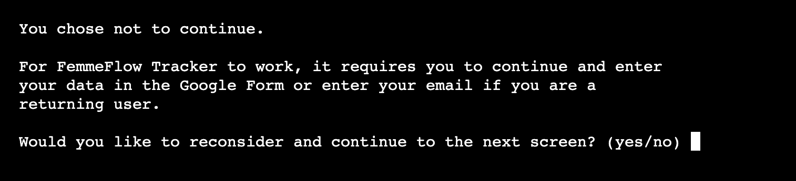

- **User Reconsideration - Proceed (Yes):** If the user chooses to reconsider and proceed ("yes"), the `open_google_form()` function is called again to open the Google Form. The user is prompted to press Enter once they have submitted the data in the form.

- **User Reconsideration - Do Not Proceed (No):** If the user chooses not to proceed ("no"), a farewell message is displayed, addressing the user by name. The message expresses gratitude for accessing FemmeFlow Tracker and encourages the user to return if they change their mind. The application then gracefully exits.
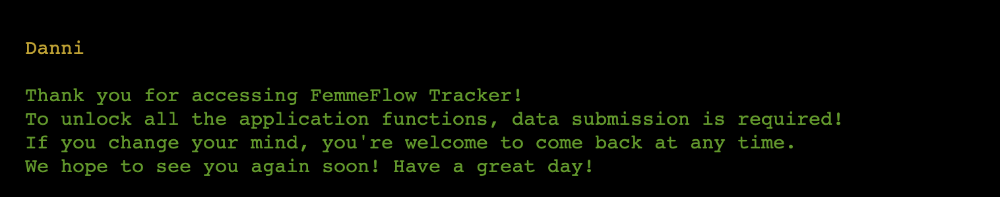

This feature of the application focuses on user engagement and decision-making, ensuring that the user is informed about the data submission process and has the opportunity to make a choice that aligns with their preferences. The application's clear messaging and well-structured interactions enhance the user experience.

[BACK TO TABLE OF CONTENT 🔼 ](#table-of-content--)

### ➥ OPEN GOOGLE FORM PAGE
---
The `open_google_form()` function is responsible for facilitating the process of opening a specified Google Form URL in the user's default web browser. This feature allows users, whether new or returning, to enter their information into the Google Form, which is a crucial step for utilizing the FemmeFlow Tracker application. Here's a breakdown of this feature:

- **Open Google Form URL:** The function starts by specifying the URL of the Google Form (`form_url`). This URL is the location where users can input their information. [FemmeFlow tracker Google Form](https://forms.gle/BmqAMvNzfy4sn7YU8). Without filling in the form, the user cannot access the main features of this application.

- **Display Google Form Information:** The function then displays a header indicating that it is related to the Google Form, followed by an animated green text that provides instructions to new users. 

- **Display Form URL:** The function prompts the user to copy and paste the form URL into their browser. The form URL is displayed in blue with an underline, making it visually distinct. The user is guided to the URL through colored and styled text.

- **Instructions for Returning Users:** The function proceeds to display a section for returning users. It communicates that returning users can save time by simply pressing 'Enter' and providing their previously used email address. This option allows them to skip the form if they have previously filled it out.

- **Prompt to Access Data:** The function concludes by informing the user that after entering their information into the Google Form, they can return to the application to access their data and utilize all the features it offers.

Overall, this feature provides clear instructions and guidance to users on how to access and interact with the Google Form, whether they are new users who need to fill out the form or returning users who can bypass it using their email address. The user-friendly presentation of information, coupled with color-coded text and animation, enhances the user experience and ensures that users understand the necessary steps to proceed within the application.

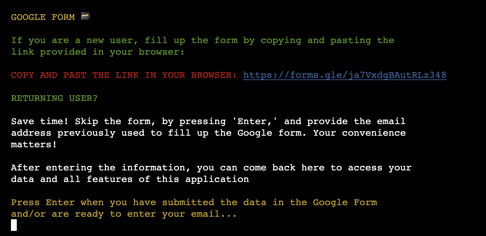

[BACK TO TABLE OF CONTENT 🔼 ](#table-of-content--)

### ➥ AUTOMATED EMAIL NOTIFICATIONS
---
- **Dedicated email address:** A dedicated email address has been established exclusively for use with the application, ensuring an enhanced and more gratifying user experience when receiving correspondence from our platform.

- **Tailored Email:** Following the submission of menstrual cycle information via the form, the application rapidly generates a tailored email employing the Apps Script functionality.

- **Insightfull data:** This email serves as a conduit of crucial insights regarding the upcoming menstrual cycle, encompassing essential details such as the projected next period date and the window of fertility.

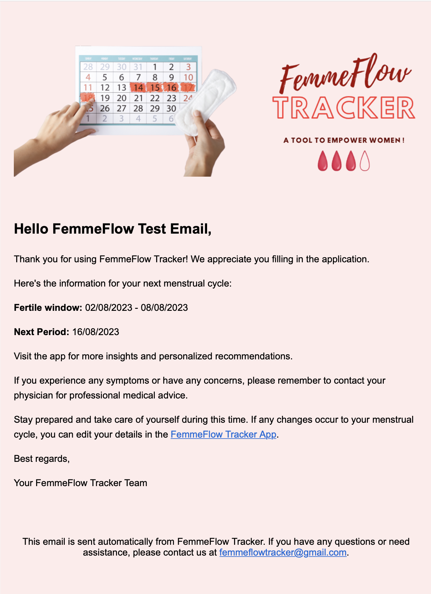

[BACK TO TABLE OF CONTENT 🔼 ](#table-of-content--)

### ➥ EMAIL COLLECTION AND VALIDATION

The `get_user_email()` function handles the process of collecting and validating the user's email address, which is used to match the email address they provided in the Google Form. This feature ensures that the user is properly identified and can access their data and the application's features. Here's an explanation of this function's behavior:

- **Display Prompt and User Name:** The function starts by addressing the user by their name in yellow.

- **Prompt for Email Address:** It prompts the user to enter the email address they used to fill out the Google Form. The purpose of this input is to verify the user's identity.


- **Input and Validation:** The user enters their email address, which is stored in the `user_email` variable. The input is converted to lowercase to ensure consistency during comparison.

- **Invalid Email Handling:** If the user does not provide a valid email address (i.e., an empty input), an error message is animated in red using the `animate_text()` function. This informs the user that a valid email address is required.

- **Loop for Valid Input:** The function continues to prompt the user for input until a valid email address is provided. This loop ensures that the user cannot proceed until a valid email address is entered.


- **Return Valid Email:** Once a valid email address is entered, the function returns the validated email address.

Overall, this feature ensures that the user's email address is collected accurately and matches the one they used in the Google Form. By collecting this information, the application can associate the user with their data and provide them with personalized access to its features. The use of colored text and input validation helps guide the user through the process and ensures that the correct information is obtained for successful interaction with the application.

[BACK TO TABLE OF CONTENT 🔼 ](#table-of-content--)

### ➥ FETCH USER DATA
---
The `fetch_user_data` function is responsible for retrieving and processing user data from a Google Sheets response worksheet based on the provided email address. The function performs the following steps:

- **Find Rows with Matching Email:** The function searches for all rows in the Google Sheets response worksheet that match the provided email address. It identifies the cells containing the email and determines the corresponding row numbers.

- **Retrieve User Data:** The function retrieves the data from the identified rows in the worksheet. Each row represents a user response, and the function gathers all relevant data from these rows.

- **Filter Invalid Data:** The retrieved user data may contain incomplete or invalid entries. The function filters out any rows with data that do not match the expected number of columns, ensuring that only valid responses are considered.

- **Sort by Timestamp:** The valid user data is sorted by timestamp in descending order. This arrangement ensures that the latest response is at the top of the list, making it the most recent entry.

- **Return Processed Data:** The function returns the processed and sorted user data as a list of lists, where each inner list represents a user response entry. If no valid data is found for the provided email address, the function returns `None`.

The `fetch_user_data` function plays a crucial role in retrieving and preparing user responses for further processing and analysis within the FemmeFlow Tracker application. It ensures that only valid and relevant data are considered while providing a mechanism to access the most recent user responses based on the timestamp.

[BACK TO TABLE OF CONTENT 🔼 ](#table-of-content--)

### ➥ OPTIONS TABLE
---
#### ⤵ TABLE OVERVIEW ⤵

The `print_options()` function is responsible for displaying a table of available options that the user can choose from within the FemmeFlow Tracker application. It provides a clear and user-friendly interface for the user to make selections. Here's how this function works:

- **Initializing Colorama:** The function starts by initializing Colorama to ensure that text color changes are handled correctly.

- **Print Description:** A description is printed, guiding the user on how to make a selection by entering the corresponding number.

- **Table Creation:** The function uses the PrettyTable library to create a table with two columns: "Option" and "Description." Each row in the table represents an available option in the application, and the table includes the following options:

   - Health Tips
   - Form Submission Data
   - Fertile Days
   - Next Period Date
   - Personalized Recommendations
   - Exercises Tips
   - Application Rules
   - Quit the application
    
- **Setting Table Color:** The table text is colored in red using Colorama, creating a visually distinctive and attention-grabbing display for the user.

- **Print Table:** The colored table is printed to the console, presenting the available options and their corresponding descriptions to the user.

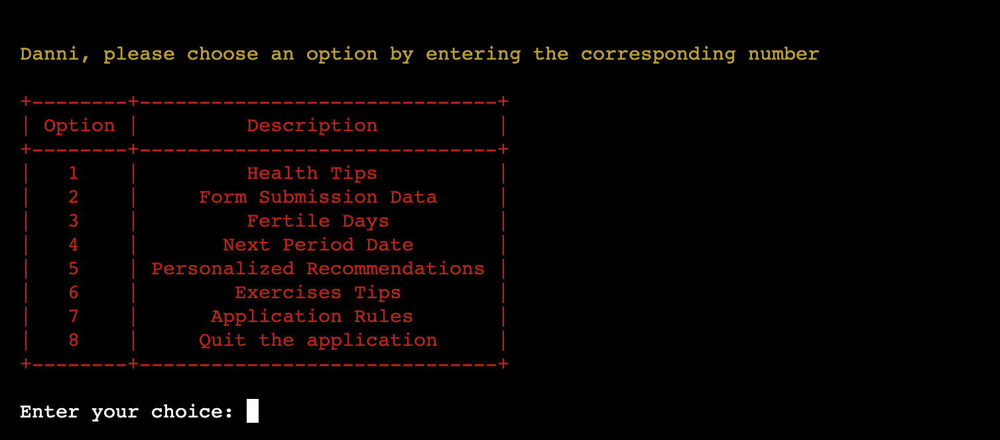

Overall, the `print_options()` function contributes to the user-friendly and interactive nature of the FemmeFlow Tracker application. It provides a structured presentation of the available features, making it easy for users to select the functionality they wish to access. The use of colors and a well-formatted table enhances the visual appeal and usability of the application's interface.

[BACK TO TABLE OF CONTENT 🔼 ](#table-of-content--)

#### ⤵ TABLE OPTION 1 ⤵

The `display_health_tips` function is responsible for providing users with valuable health tips to effectively manage their menstrual cycle. This feature is designed to improve users' well-being and make their periods more manageable. The function operates as follows:

- **Display Title and Introduction:** The function displays the title "HEALTH TIPS 🌟" in yellow text, indicating that health tips are being presented. An introduction is also displayed, explaining the importance of taking care of one's health during the menstrual cycle and encouraging users to follow the provided tips.
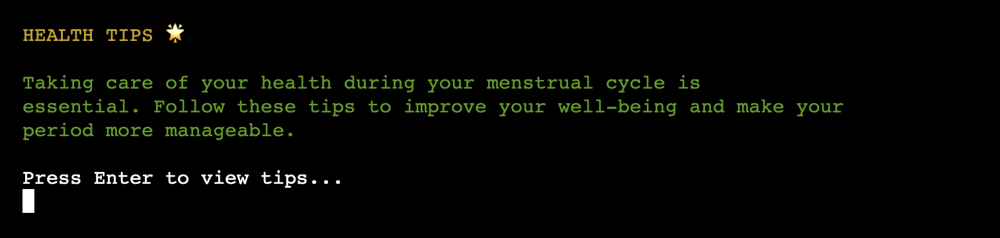

- **Prompt for Viewing Tips:** Users are prompted to press Enter to view the health tips. This prompt allows users to proceed at their own pace.

- **Display Regular Cycle Tips:** The function presents a table of health tips for individuals with regular menstrual cycles. Each tip is assigned a number, and the tips are provided in a well-formatted table with two columns: "Tip Number" and "Tip Text." Tips cover various aspects of health, including diet, exercise, stress management, and more.
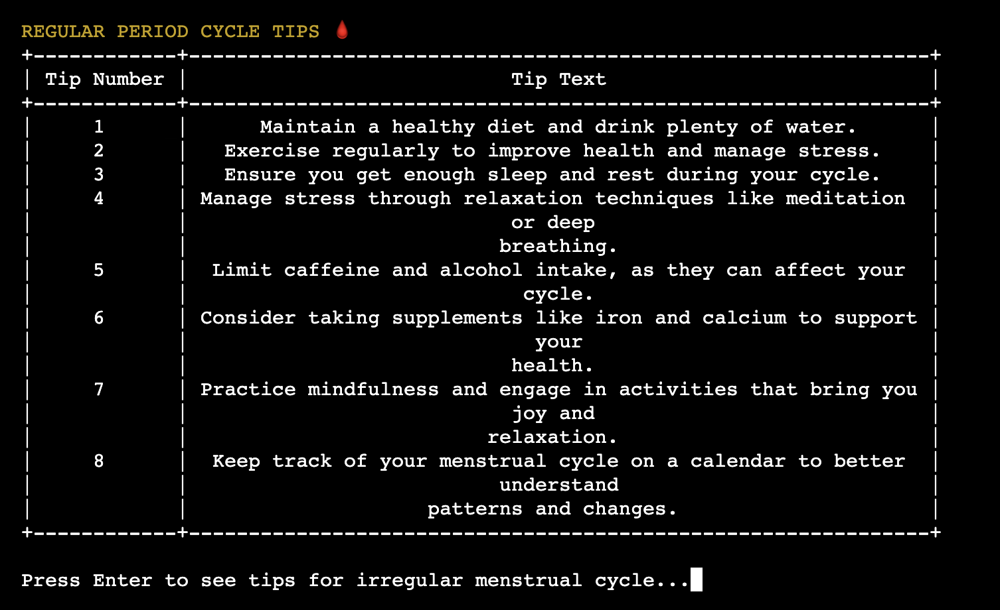

- **Display Irregular Cycle Tips:** If the user's cycle is irregular, the function allows users to press Enter to see additional health tips specific to irregular menstrual cycles. A separate table is displayed for these irregular tips. This ensures that users with irregular cycles receive targeted advice to address their specific concerns.
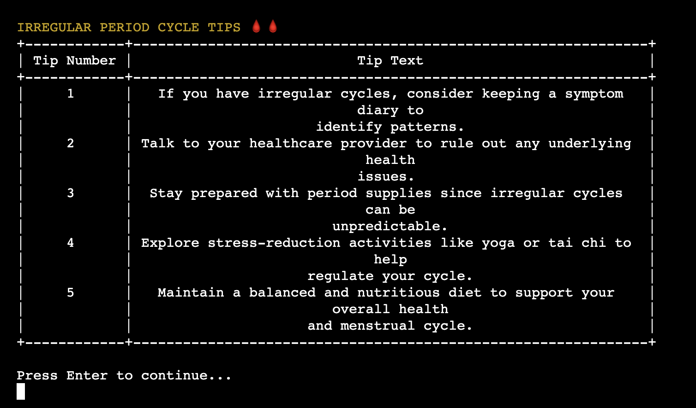

- **Continue or Proceed:** After displaying both regular and irregular tips, users are prompted to press Enter to continue. This prompt ensures that users have enough time to read and absorb the provided information.

Overall, the `display_health_tips` function enhances the user's knowledge about maintaining good health during the menstrual cycle by offering practical and tailored advice. The function utilizes formatting and prompts to ensure that users can access and understand the tips easily, promoting a positive and informed menstrual health journey.

[BACK TO TABLE OF CONTENT 🔼 ](#table-of-content--)

#### ⤵ TABLE OPTION 2 ⤵

The `update_data` function allows users to update their menstrual cycle data through the terminal. This feature provides users with the flexibility to correct or modify their details as needed. The function operates as follows:

- **Header and Acknowledgment:** This part serves as an acknowledgment of the user's data submission and emphasizes the importance of the provided information. It underscores how tracking their menstrual cycle can lead to better insights and well-being management.


- **Google Form Submited Data:** A formatted table displays the submitted user data, including the name, age, email, last period date, cycle length, period duration, cycle type, and symptoms. Each row represents a specific field, and the corresponding value is provided in the adjacent column.
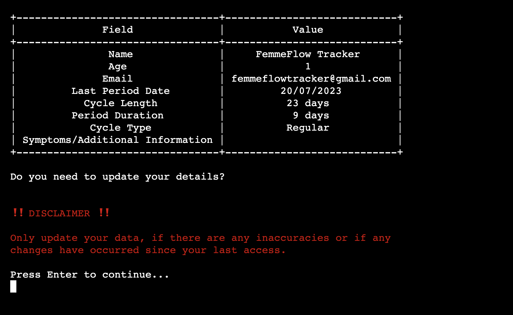

- **Update Option and Disclaimer** An question prompts the user to consider whether they need to update their details. It indicates that the option to update is available if there are any inaccuracies or changes since their last access. The disclaimer emphasizes the importance of updating data only if necessary. It provides a cautionary note that data should be modified only in cases of inaccuracies or changes since the user's last access.
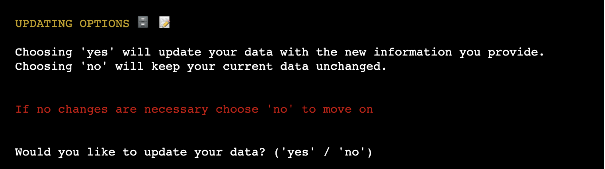

- **Display Title and Introduction:** The function displays the title "UPDATE DATA 🗃" in yellow text, indicating that the user's data can be updated. An introduction is provided, guiding the user through the process of updating their menstrual cycle data. The user is informed that their name and age cannot be updated.

- **Get Updated Last Period Date:** The function prompts the user to input an updated last period date. The current last period date is displayed in the prompt. If the user chooses to skip updating this field or enters an empty value, the function informs the user that the last period date was not updated. If a valid date is entered, the function updates the global `last_period` variable.

- **Get Updated Cycle Length:** The user is prompted to input an updated cycle length. If the user chooses to skip updating this field, the function proceeds. Otherwise, it attempts to convert the input to an integer and updates the global `cycle_length` variable if the input is valid.

- **Get Updated Period Duration:** Similar to the cycle length, the user is prompted to input an updated period duration. If the user chooses to skip updating this field, the function proceeds. If the input is valid, the global `period_duration` variable is updated.

- **Get Updated Cycle Type:** The user is prompted to update their cycle type. They can choose from options such as "regular," "irregular," or "skip." If a valid option is chosen (other than "skip"), the global `cycle_type` variable is updated.
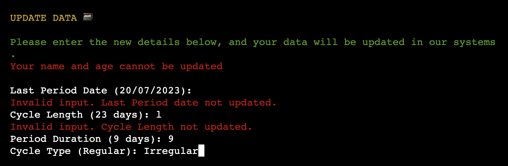

- **Get Updated Symptoms:** The function displays a list of available symptoms in a table-like format. The user is prompted to enter updated symptoms separated by commas. The input is converted to lowercase for case-insensitive comparison. If valid symptoms are provided, the global `symptoms` variable is updated.
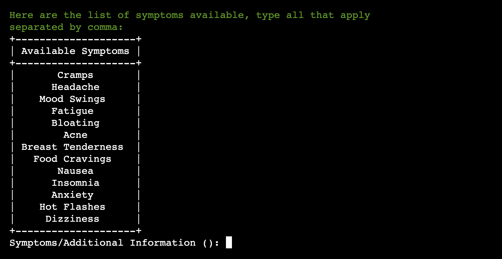

- **Processing and Data Update:** After collecting the updated information, the function displays a processing animation to indicate that the data is being updated. The Google Sheets are then updated with the new data using the `update_google_sheets` function.

- **Success Message:** Once the update is complete, the function displays a success message in green text to inform the user that their data has been updated successfully.


The `update_data` function provides users with a user-friendly way to modify their menstrual cycle data, ensuring that the application's information remains accurate and up-to-date.

#### ⤵ Updating Google Sheets ⤵

The `update_google_sheets` function is responsible for updating user data in the Google Sheets document based on the changes edited in the terminal. This function plays a crucial role in maintaining accurate and up-to-date records of users' menstrual cycle data. 
Here's how the function works:

- **Function Signature:** The function `update_google_sheets` takes several parameters: `email`, `last_period`, `cycle_length`, `period_duration`, `cycle_type`, and `symptoms`. These parameters represent the updated data that needs to be stored in the Google Sheets document.

- **Finding Matching Rows:** The function begins by searching for all rows in the Google Sheets document where the email address matches the provided `email`. It uses the `findall` method to locate all cells containing the specified email.

- **Extracting Rows:** For each cell containing the email address, the function extracts the corresponding row number. This ensures that all rows associated with the user's email address are identified.

- **Updating Rows:** The function then iterates over the set of row numbers obtained in the previous step. For each row, it uses the `update_cell` method to modify specific columns within that row. The columns updated include the last period date, cycle length, period duration, cycle type, and symptoms. The updated values are taken from the provided parameters.

- **Updating Google Sheets:** The function essentially applies the changes to each identified row, ensuring that the user's data is accurately updated in the Google Sheets document.

By utilizing the `update_google_sheets` function, the application maintains a synchronized and consistent dataset in the Google Sheets document, reflecting the most recent information about users' menstrual cycle data. This process is vital for ensuring that users receive accurate insights, recommendations, and predictions based on their updated details.

[BACK TO TABLE OF CONTENT 🔼 ](#table-of-content--)

#### ⤵ TABLE OPTION 3 ⤵

The `display_fertile_days` function serves the purpose of presenting projected fertile days for the next 6 months to users. This feature is particularly useful for individuals who are planning a pregnancy or seeking to understand their potential conception periods. Here's an overview of how the function works:

- **Header and Description:** The function begins by displaying a header and description of the fertile days feature. The description underscores the importance of knowing fertile days for pregnancy planning and awareness. The text is formatted in YELLOW to draw attention.

- **Table Creation and Population:** The function creates a table using the `PrettyTable` library with three columns: Month, Fertile Start Date, and Fertile End Date. It then enters a loop that iterates six times to populate the table with projected fertile days for each of the next six months.

- **Table Content:** In each iteration of the loop, the function adds a row to the table with the following information:
   - Month: The full name of the month and the corresponding year.
   - Fertile Start Date: The start date of the fertile period for that month.
   - Fertile End Date: The end date of the fertile period for that month.

   The fertile start and end dates are incremented by 28 days in each iteration, which roughly corresponds to the length of a menstrual cycle.

- **Table Display:** Once the table is populated, the function prints the table to the terminal. The table neatly organizes and displays the projected fertile days for the next 6 months. 

In summary, the `display_fertile_days` function offers a user-friendly and informative presentation of projected fertile days over the next 6 months. This feature empowers users with valuable insights into their fertility windows, supporting their family planning and conception-related decisions.
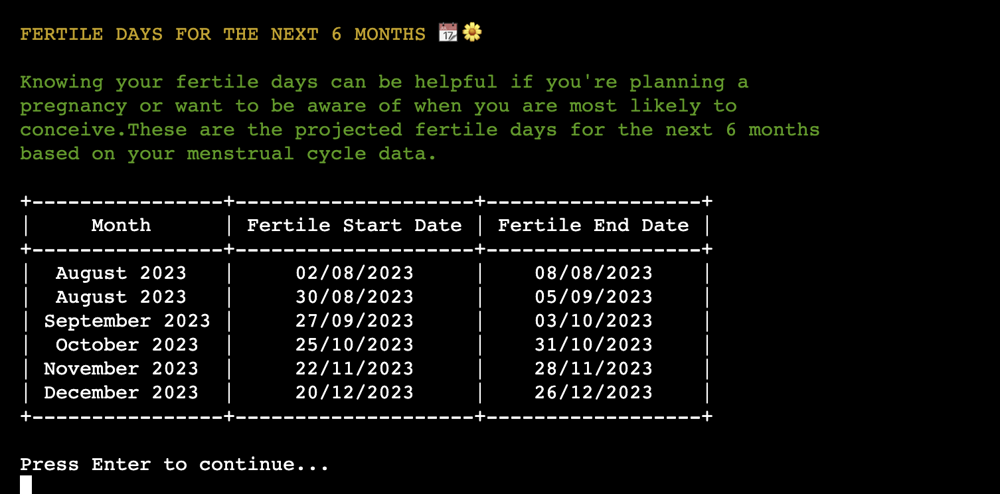

[BACK TO TABLE OF CONTENT 🔼 ](#table-of-content--)

#### ⤵ TABLE OPTION 4 ⤵

The `display_next_period_date` function offers users insights into their predicted next period dates for the upcoming six months. This feature is designed to aid individuals in tracking their menstrual cycle, whether for reproductive health awareness or planning purposes. Here's a breakdown of how the function operates:

- **Header and Description:** The function commences by displaying a header and a comprehensive description of the upcoming period dates feature. This description emphasizes the importance of menstrual cycle tracking for reproductive health understanding, while also addressing the purpose of the projected period dates. The text is presented in YELLOW for visibility.

- **Table Creation and Filling:** A table is generated using the `PrettyTable` library, featuring two columns: Month and Next Period Date. The function then enters a loop that iterates six times to populate the table with predicted next period dates for each of the next six months.

- **Table Content:** In each iteration of the loop, the function appends a row to the table with the following data:
   - Month: The full name of the month along with the corresponding year.
   - Next Period Date: The projected start date of the next menstrual period for that month.

   The `next_period` date is increased by 28 days in each iteration, approximating the length of a typical menstrual cycle.

- **Table Display:** Once the table is populated, the function prints the table to the terminal. The table format effectively organizes and presents the forecasted next period dates for the forthcoming six months. This information is beneficial for users aiming to plan their schedules or be prepared for upcoming menstrual cycles.

In summary, the `display_next_period_date` function provides users with a visually appealing and informative overview of their anticipated next period dates over the upcoming six months. 
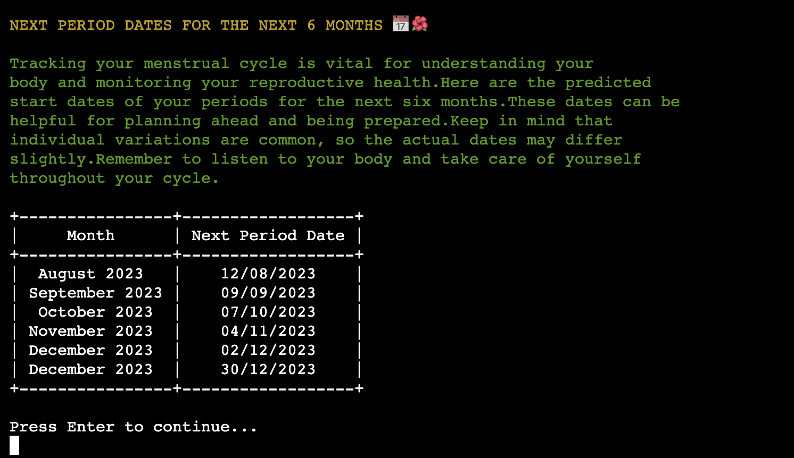

[BACK TO TABLE OF CONTENT 🔼 ](#table-of-content--)

#### ⤵ TABLE OPTION 5 ⤵ 

The three functions presented bellow work together to calculate important menstrual cycle dates, display personalized recommendations for specific symptoms, and provide tailored advice to users based on their cycle data and symptoms.

##### 🔽 Calculate Dates and Recommendations

The `calculate_dates_and_recommendations` function calculates important dates for the user's menstrual cycle and invokes the `personalized_recommendations` function to generate personalized recommendations. Here's a description of how it works:

- **Calculation of Dates:** The function calculates the next period date, fertile days' start and end dates based on the user's last period date and cycle length. The calculated dates are stored in global variables (`next_period`, `fertile_start`, `fertile_end`).

- **Invoking Personalized Recommendations:** The function calls the `personalized_recommendations` function with `cycle_length`, `period_duration`, and `symptoms` as arguments to generate personalized recommendations.

#####  🔽 Display Recommendations Table

The `display_recommendations_table` function is responsible for displaying personalized recommendations for dealing with a specific symptom. Here's an overview:

- **Display Recommendations:** The function displays a header in RED, indicating the specific symptom for which recommendations are being displayed. It then creates a table using the PrettyTable library to present the recommendations in a structured format.

#####  🔽 Personalized Recomentations

The `personalized_recommendations` function generates personalized recommendations based on menstrual cycle data, addressing symptoms and offering advice. Here's an overview of how it works:

- **Introduction and User Interaction:** The function displays a header in YELLOW and an introductory message. Users are prompted to press Enter to continue.
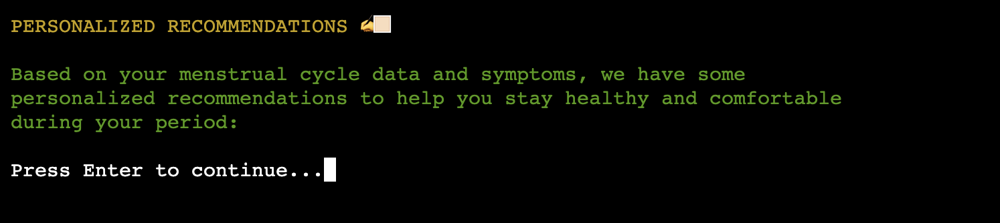

- **Cycle Length Advice:** Advice is provided if the user's cycle length is less than 28 days. The advice is displayed in a formatted table.
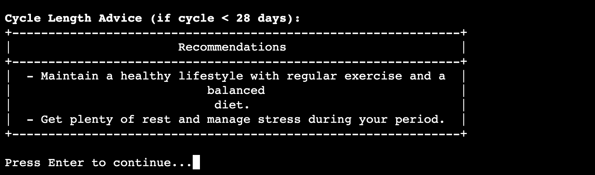

- **Period Duration Advice:** Advice is provided if the user's period duration is greater than 7 days. The advice is displayed in a similar table format.
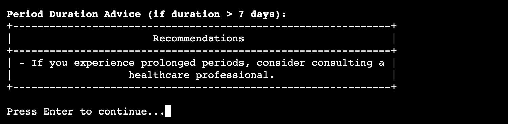

- **Short Period Advice:** Advice is given if the user's period duration is less than 3 days. The advice is displayed in a formatted table.
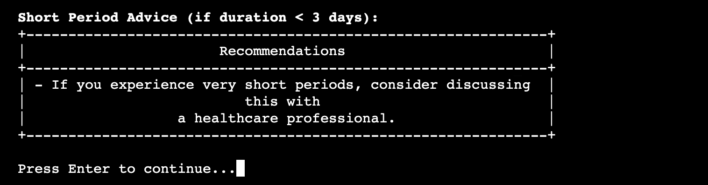

- **Symptom-Specific Recommendations:** Personalized recommendations are defined in a dictionary named `recommendations`. The function filters symptoms based on the user's input and displays recommendations for each selected symptom. Recommendations are presented in formatted tables.
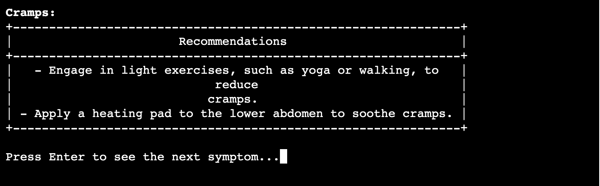

- **Advisory Message:** After all recommendations are displayed, an advisory message is shown in RED, emphasizing that the recommendations provide general guidance and encouraging users to seek personalized advice from healthcare professionals.


In summary, this comprehensive approach supports users in managing their well-being during their menstrual cycle.

[BACK TO TABLE OF CONTENT 🔼 ](#table-of-content--)

#### ⤵ TABLE OPTION 6 ⤵

The `display_exercises_tips` function provides exercise recommendations to help reduce menstrual cramps, improve mood, and promote overall well-being during the menstrual cycle. It displays two separate tables: one for cramp-reducing exercises and another for mood-improving exercises. Here's how the function works:

- **Introduction and User Interaction:** The function displays a header in YELLOW and an introductory message about the benefits of regular physical activity during the menstrual cycle. Users are prompted to press Enter to continue.

- **List of Exercises:** The function defines two separate lists: `cramp_exercises` and `mood_exercises`, which contain exercise recommendations for reducing cramps and improving mood, respectively.

- **Creating Tables:** Two separate PrettyTable objects are created: `cramp_table` for cramp-reducing exercises and `mood_table` for mood-improving exercises. The exercise recommendations are added to the tables along with corresponding numbering.

- **Formatted Table Strings:** The tables are converted to formatted string representations using the `get_string` method.

- **Displaying Tables Side by Side:** The formatted table strings are split into lines, and the corresponding lines from both tables are printed side by side to display the exercise recommendations for cramp reduction and mood improvement together.

In summary, the `display_exercises_tips` function provides users with exercise recommendations that can help alleviate discomfort and improve mood during their menstrual cycle. The function's organized presentation of exercise options contributes to users' well-being and provides them with practical strategies for managing their menstrual symptoms.
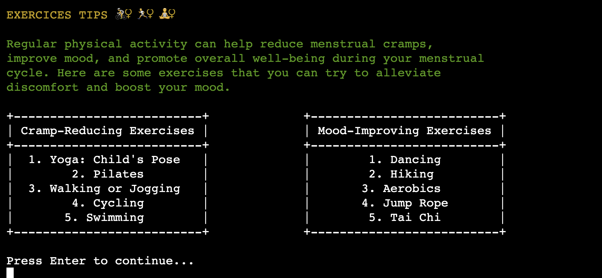

[BACK TO TABLE OF CONTENT 🔼 ](#table-of-content--)

#### ⤵ TABLE OPTION 7 ⤵ 

- Choosing option 7 allows the user to view the rules and functionality of the FemmeFlow Tracker application again. 
- This feature provides information about how the application works, its features, and any specific guidelines users should follow. 
- The user is presented with an overview of the application's rules without having to input any additional message.

In summary, option 7 provides a quick way for users to access information about the application's functionality
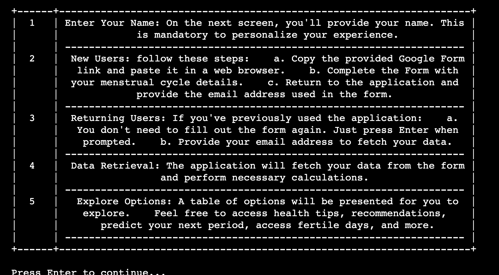

#### ⤵ TABLE OPTION 8 ⤵ 

- The user's name (retrieved from the `user_name` variable) is displayed in yellow.
- A thank you message is displayed in green, expressing gratitude for using the FemmeFlow Tracker.
- The application informs the user that they can return and use the application again in the future.
- The application loop is exited, and the program terminates.

In summary, option 8 allows users to gracefully exit the application with a friendly farewell message.


[BACK TO TABLE OF CONTENT 🔼 ](#table-of-content--)

### ➥ FEATURES LEFT TO IMPLEMENT
---
Absolutely, those are great ideas for enhancing your FemmeFlow Tracker application. Let me elaborate on each of them:

#### ⤵ Sign Up and Sign In System ⤵ 

Implementing a sign-up and sign-in system will allow users to create accounts and securely access their personalized menstrual cycle data.

- **User Registration:** Create a registration form where users can provide their name, email address, and choose a password. Use a secure authentication method to store user credentials.

- **Security:** Implement strong security measures, including encryption of sensitive data and secure password storage using techniques like bcrypt.

#### ⤵ Monthly Email Reminder ⤵

Sending users a monthly email reminder a few days before their period is due to help them prepare and manage their menstrual health effectively.

- **User Preferences:** Within the user profile, include an option for users to opt-in to receive email reminders. Allow them to set the number of days before their expected period date when they'd like to receive the email.

- **Email Automation:** Implement an email automation system using a service like SendGrid or a similar email delivery service. Schedule automated emails to be sent to users based on their preferences.

- **Customizable Content:** Personalize the email content with the user's name and provide valuable information such as upcoming period dates, cycle insights, and relevant health tips.

- **Unsubscribe Option:** Include an unsubscribe option in the emails so users can easily opt-out of receiving reminders if they no longer wish to receive them.

By implementing these features, FemmeFlow Tracker application will provide valuable tools for users to manage their menstrual health and well-being more effectively.

[BACK TO TABLE OF CONTENT 🔼 ](#table-of-content--)

---
## ➡ UX DESIGN


The FemmeFlow Tracker App aims to provide a comprehensive and user-friendly solution for women to track and manage their menstrual cycles effectively. Users can access valuable insights about their menstrual health, including cycle predictions, fertile windows, personalized recommendations, and exercise tips.

### ➥ USER GOALS
---
- Users want to track their menstrual cycles and receive accurate predictions for their next period and fertile days.
- Users need personalized recommendations to manage symptoms and enhance their well-being during their menstrual cycle.
- Users wish to access exercise tips tailored to their needs to alleviate cramps and improve mood.

### ➥ APPLICATION ADMIN GOALS
---
- Offer users a comprehensive range of features, including cycle tracking, predictions, recommendations, and exercise tips.
- Implement clear and intuitive navigation for users to access different functionalities seamlessly.
- Provide accurate and helpful information in a visually appealing and readable format.
- Develop a user-centric design with clean, reusable, and well-documented code, following best practices for readability and maintainability.
- Handle errors gracefully and ensure the security of sensitive user data.
  
### ➥ SCOPE
---
- Users can input their menstrual cycle data, including the last period date, cycle length, period duration, cycle type, and symptoms.
- The app calculates and displays the next period date, fertile days, and provides personalized recommendations for each symptom.
- Users can access exercise tips to reduce cramps, improve mood, and enhance well-being during their menstrual cycle.

### ➥ STRUCTURE
---
- The app's structure is designed with clear navigation, guiding users to different functionalities such as cycle tracking, predictions, recommendations, and exercise tips.
- User data is organized and stored securely, ensuring privacy and confidentiality.

### ➥ COLOUR SCHEME
---
The color scheme for the FemmeFlow Tracker application is a combination of different colors, each serving a specific purpose. Here is a description of the color scheme elements:

1. Yellow (Fore.YELLOW):
   - Represents highlights or attention-grabbing elements.
   - Used for headings, important messages, and key information.
   - Creates a vibrant and noticeable contrast against the background.
   

2. Green (Fore.GREEN):
   - Indicates success, positivity, or important details.
   - Used for introductory messages, success messages, and positive content.
   - Creates a sense of vitality and freshness.
   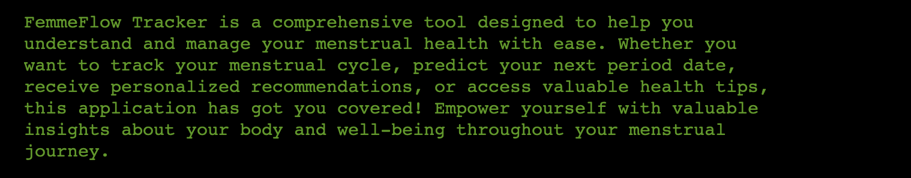

3. Red (Fore.RED):
   - Signifies warnings, alerts, or critical information.
   - Used for disclaimers, error messages, and cautionary content.
   - Draws immediate attention and encourages users to take notice.
   

4. Reset (Fore.RESET):
   - Returns the text color to the default state.
   - Used to maintain consistency and readability after using other colors.
   - Ensures that subsequent text is displayed in the standard color.

The color scheme in the application effectively convey different types of information to the user. It uses contrasting colors to highlight important details, create visual hierarchy, and guide users' attention to key elements. The color choices align with standard conventions for conveying meaning, such as using green for positive messages and red for warnings.

[BACK TO TABLE OF CONTENT 🔼 ](#table-of-content--)

### ➥ IMAGERY AND LANDING PAGE INTERFACE
---
The imagery and style of the FemmeFlow Tracker application create a visually engaging and cohesive user experience, aligning with the theme and purpose of the app.

#### ⤵ Logo Description ⤵
- The logo serves as the visual identity of the FemmeFlow Tracker application. It features a pair of hands that are pointing to a calendar while holding a menstrual pad. This imagery effectively captures the essence of the app, which is centered around tracking menstrual cycles. The hands represent empowerment and guidance, suggesting that the app assists users in understanding and managing their menstrual health. The text "FemmeFlow Tracker" is displayed prominently beside the imagery, indicating the app's name. Beneath the name, the tagline "A tool to empower women!" reinforces the app's purpose of providing valuable insights and support to women. Additionally, three blood drop emojis further reinforce the menstrual cycle theme.


#### ⤵ Favicon Image ⤵
- The favicon image for the FemmeFlow Tracker application is a condensed representation of the logo, focusing on the essential elements to create a recognizable and visually appealing icon. The favicon image captures the portion of the logo where the "FemmeFlow Tracker" text and the tagline "A tool to empower women!" are located.


#### ⤵ Terminal Interface ⤵
- The central focus of the app's interface is the terminal. It is displayed prominently in the middle of the page and showcases a fixed-width area where text-based interactions take place.

#### ⤵ Background Image ⤵
- The background of the application adds depth and context to the overall design. It features a white background with subtle visual elements at the very bottom. These visual elements consist of menstrual pads, which creatively reinforce the menstrual cycle theme. The pads are strategically placed at the bottom of the background, ensuring they do not interfere with the readability of the terminal and other essential elements.
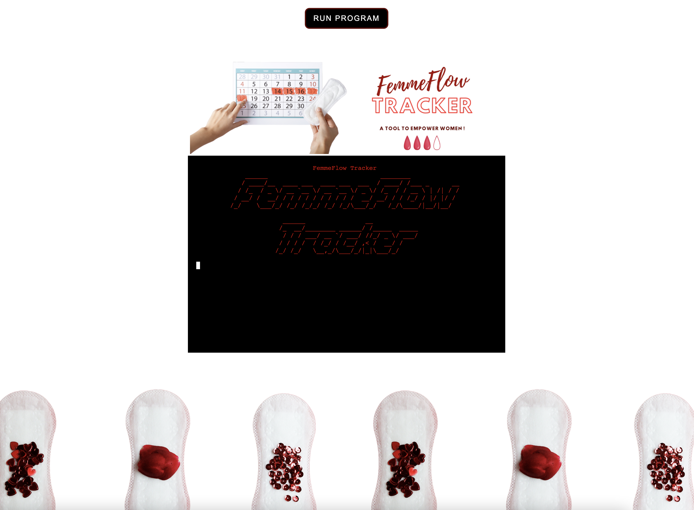

In summary, the imagery and style of the FemmeFlow Tracker application are thoughtfully designed to align with its purpose of helping users track and manage their menstrual cycles.

[BACK TO TABLE OF CONTENT 🔼 ](#table-of-content--)

### ➥ RESPONSIVE DESIGN
---
- The application's design is responsive, catering to various screen sizes. On smaller screens, such as mobile devices, the background image adapts to cover the entire screen while maintaining the logo's visibility and legibility. This responsive approach ensures that users have a consistent and enjoyable experience across different devices.

By adopting this UX design approach, the FemmeFlow Tracker App is tailored to empower users with valuable insights and tools for managing their menstrual health. The design focuses on user engagement, ease of use, and the presentation of accurate and relevant information to enhance users' overall well-being and reproductive health.

[BACK TO TABLE OF CONTENT 🔼 ](#table-of-content--)

---
## ➡ TECHNOLOGIES USED


### ➥ LANGUAGES USED

- **Python:** More than 80% of the programming language employed in creating this application was Python.
- **HTML:** Some adjustments were implemented to the imported format from Code Institute.
- **CSS:** Several modifications were introduced to the styling to attain the desired visuals and layout that best fit the application.

### ➥ FRAMEWORKS, LIBRARIES & PROGRAMS USED
---
- **os:** Used to access system methods for tasks like clearing the terminal screen.
- **textwrap:** Utilized for formatting text output within the terminal.
- **sys:** Used for system-specific functions and operations.
- **pyfiglet:** Employed for generating ASCII art text banners.
- **colorama:** Used in conjunction with `termcolor` for applying colors to terminal text.
- **termcolor:** Utilized for applying foreground and background colors to terminal text.
- **webbrowser:** Enabled the program to open web browser windows.
- **time:** Accessed the sleep method for introducing pauses during critical points of information relay.
- **datetime:** Employed for date and time operations and manipulation.
- **prettytable:** Utilized for creating and formatting tables within the terminal.
- **dateutil.parser:** Used for parsing date strings.
- **gspread:** Used for interacting with Google Sheets, enabling CRUD actions.
- **google.oauth2.service_account:** Imported for working with Google Sheets and authentication.
- **Code Institute PEP8 Linter:** Utilized to perform a code check, ensuring adherence to Python coding standards and best practices.
- **Code Anywhere:** Employed as a cloud-based Integrated Development Environment (IDE) for the initial stages of the project.
- **Git:** Used for version control, enabling efficient tracking and management of code changes.
- **GitHub:** Acted as a cloud repository for Git version control.
- **Google Form:** Utilized to create a user-friendly form for users to input their data, which is integral for the application's functionality. [FemmeFlow tracker Google Form](https://forms.gle/BmqAMvNzfy4sn7YU8)

- **Google Sheets:** A cloud-based service utilized to store the data collected from the Google Form. The information stored in Google Sheets is essential for maintaining and operating the application. It consists of two primary sheets:

  - **Responses Sheet:** This sheet contains data collected from user submissions through the Google Form. It includes details such as the timestamp of submission, user-provided menstrual cycle information, symptoms, email address, name, and age.
  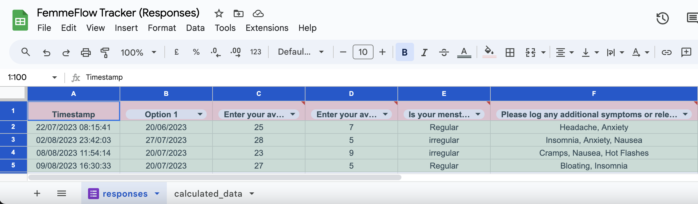

  - **Calculated Data Sheet:** This sheet contains calculated data derived from the user-submitted information.
  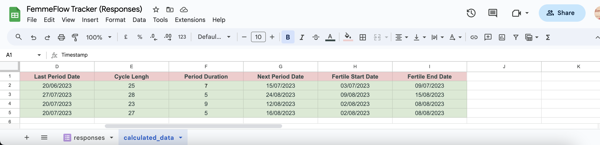

[BACK TO TABLE OF CONTENT 🔼 ](#table-of-content--)

---
## ➡ TESTING


To access the testing results please check the [TESTING.md](TESTING.md) file

--- 
## ➡ DEVELOPMENT AND DEPLOYMENT PROCESS


- Developed a terminal-based game in Python utilizing the Code Institute's [Python Essentials Template](https://github.com/Code-Institute-Org/python-essentials-template)
- Began development within the mock terminal template, then transitioned to local repository for further enhancements using CodeAnywhere.
- Integrated a [Google Form](https://forms.gle/BmqAMvNzfy4sn7YU8) to collect user details, establishing a seamless link between user input and data storage.
- Leveraged Google Sheets as the data repository, facilitating the storage and management of user information from the Google Form.
- Enabled users to update their data through the Google Form within the terminal application.
- Deployed the fully functional application on the Heroku platform, granting users easy access and interaction.
- Access the live application [HERE](https://femmeflow-tracker-06bab98fd82a.herokuapp.com/).

### ➥ CREATING A NEW REPOSITORY
---
To establish a new repository for the project, I followed these steps:

1. Sign in to or create an account on [GitHub](https://github.com/).
2. Navigate to the [Python Essentials Template](https://github.com/Code-Institute-Org/python-essentials-template) repository.
3. Click on the "Use this template" dropdown menu and choose "Create a new repository."
4. On the ensuing page, provide a name for the new repository in the "Repository name" field. Opt for the "Public" visibility option to ensure the repository's accessibility. Finally, select "Create repository."
5. Copy the repository's address from the browser's address bar.
6. Access [CodeAnywhere](https://app.codeanywhere.com/).
7. Initiate a new workspace by clicking "New Workspace." Paste the previously copied Repository URL and proceed by clicking "Create."

### ➥ LINK GOOGLE FORM TO GOOGLE SPREADSHEET
---
Here's a step-by-step guide on how to link responses from a Google Form to Google Sheets:

1. **Access Google Forms and Create Form:**
   - Log in to your Google account.
   - Go to [Google Forms](https://www.google.com/forms).
   - Click the "+" icon (+) to create a new form.
   - Add your questions and customize the form as needed.

2. **Link Responses to Google Sheets:**
   - Once your form is created, click on the "Responses" tab at the top of the form editor.

3. **Create a New Spreadsheet:**
   - In the "Responses" tab, you'll see a green Sheets icon (Google Sheets logo) on the right-hand side.
   - Click on the green Sheets icon to create a new Google Sheets spreadsheet.

4. **Choose Destination:**
   - A dialog box will appear asking you to choose where to store your form responses.
   - You can either create a new spreadsheet or select an existing one.
   - Choose "Create a new spreadsheet" if you want to create a dedicated spreadsheet for the form responses.

5. **Access Google Sheets:**
   - Once you've chosen the destination, click "Create" or "Select" (depending on your choice).
   - Google Forms will automatically create a linked Google Sheets spreadsheet.

6. **View Form Responses in Google Sheets:**
   - You'll be redirected to the newly created Google Sheets spreadsheet.
   - The spreadsheet will have columns corresponding to each question in your form, as well as a timestamp column for each response.

7. **Collect and Analyze Data:**
   - As respondents submit your form, their responses will be automatically added to the linked Google Sheets spreadsheet.
   - You can view, analyze, and manipulate the collected data in Google Sheets.

8. **Access Form and Spreadsheet Anytime:**
   - Your form is now set up to collect responses directly into the linked Google Sheets spreadsheet.
   - You can access your form and the linked spreadsheet at any time from your Google Forms and Google Drive accounts.

By following these steps, you'll be able to seamlessly link responses from your Google Form to a Google Sheets spreadsheet, making it easy to collect, manage, and analyze the data submitted by respondents.

### ➥ CONNECT SPREADSHEET WITH PYTHON
---
Step-by-step guide on how to connect Google Sheets spreadsheet with Python using the Google Cloud Platform (GCP) UI:

1. **Set Up a Project in Google Cloud Platform:**
   - Go to the [Google Cloud Console](https://console.cloud.google.com/).
   - Click on the project drop-down menu at the top and select "New Project."
   - Enter a name for your project (FemmeFlow Tracker) and choose an organization (No organisation). Click "Create."

2. **Enable Google Sheets API:**
   - In the Google Cloud Console, navigate to "APIs & Services" > "Library" using the sidebar menu.
   - Search for "Google Sheets API" and click on it.
   - Click the "Enable" button to enable the API for the project.

3. **Set Up OAuth 2.0 Credentials:**
   - While still in the Google Cloud Console, proceed to "APIs & Services" > "Credentials" from the sidebar menu.
   - Click on the "Create Credentials" button.
   - In the "Which API are you using?" dropdown, opt for Google Drive API.
   - Indicate "Application Data" for the data you'll access.
   - For the question regarding API usage with platforms like Compute Engine, Kubernetes Engine, App Engine, or Cloud Functions, select "No, I'm not using them," and then click Next.
   - Provide a name for your Service Account, such as FemmeFlowTracker, and proceed to click Create.
   - From the Role Dropdown, choose "Basic" > "Editor," and continue.
   - Access the service account you've just created by clicking on it.
   - Navigate to the "Keys" tab on the subsequent page.
   - Click the Add Key dropdown, followed by selecting "Create New Key."
   - Opt for the JSON format and confirm by clicking Create.

4. **Download Credentials JSON File:**
   - After creating the credentials, click on the download icon next to your newly created OAuth 2.0 client ID under "OAuth 2.0 Client IDs."
   - This file contains the credentials your Python script will use to access Google Sheets.

5. **Add Credentials to Workspace:**
   - Locate the JSON credentials file that you downloaded in the previous step. You can typically find it in your computer's "Downloads" folder.
   - Drag and drop the JSON file into your project workspace.
   - Rename the JSON file to `creds.json`.

6. **Open and Inspect `creds.json`:**
   - Open the `creds.json` file within your workspace.
   - Locate the `client_email` value in the JSON file (it will look like `your-project-id@your-project-name.iam.gserviceaccount.com`).

7. **Share Google Sheets with Service Account Email:**
   - Go back to your Google Sheets document.
   - Click the "Share" button located at the top right corner.
   - Paste the copied `client_email` into the sharing dialog box. Ensure you remove any surrounding quotes.
   - Choose the appropriate access level. For example, you can select "Editor" to grant full editing access.
   - Uncheck the "Notify People" option to avoid sending notifications.
   - Click the "Share" button to grant access to the service account email. This action permits your Python project to access and edit the spreadsheet.

8. **Protect Sensitive Credentials:**
   - As the `creds.json` file contains sensitive information, it must never be committed or pushed to GitHub to ensure security.
   - Notice the `.gitignore` file in your workspace, which contains a list of files and directories that should not be committed or pushed to GitHub.
   - To safeguard your credentials, add `creds.json` to the `.gitignore` file. This prevents it from being accidentally uploaded to your version control repository.
   - Save the `.gitignore` file after adding `creds.json` by pressing CTRL-S (or equivalent for your system).

9. **Install Required Python Libraries:**
   - In your Python environment, install the required libraries using pip:
     ```
     pip3 install google-auth
     ```

10. **Use Python Code to Access Google Sheets:**

Use the following Python code to access your Google Sheets spreadsheet. 

```python
# Module for working with Google Sheets and authentication
import gspread
from google.oauth2.service_account import Credentials

# Set up Google Sheets credentials and scope
SCOPE = [
    "https://www.googleapis.com/auth/spreadsheets",
    "https://www.googleapis.com/auth/drive.file",
    "https://www.googleapis.com/auth/drive"
]

# Load credentials from the service account file and create scoped credentials
CREDS = Credentials.from_service_account_file('path/to/your/downloaded/credentials.json')
SCOPED_CREDS = CREDS.with_scopes(SCOPE)

# Authorize the gspread client using the scoped credentials
GSPREAD_CLIENT = gspread.authorize(SCOPED_CREDS)

# Open the Google Sheets document named 'FemmeFlow Tracker (Responses)'
SHEET = GSPREAD_CLIENT.open('sheet name')

# Access the 'responses' worksheet within the Google Sheets document
responses = SHEET.worksheet('sheet name')
```

This code initializes the necessary credentials, authorizes the `gspread` client, and opens the 'FemmeFlow Tracker (Responses)' Google Sheets document, giving access to the 'responses' worksheet. 

By following these steps, you'll be able to connect your Google Sheets spreadsheet with Python using the Google Cloud Platform UI and retrieve data from your spreadsheet using the Google Sheets API.

[BACK TO TABLE OF CONTENT 🔼 ](#table-of-content--)

### ➥ GOOGLE SHEET SETUP TO SEND AUTOMATED EMAIL
---
To send automated emails based on the calculated data in the Google Sheets, I used the following Google Apps Script function. This function retrieves the necessary information from the spreadsheet and sends a personalized email to the last entry in the calculated_data sheet.

```javascript
function sendAutomatedEmailToLastEntry() {
  var ss = SpreadsheetApp.getActiveSpreadsheet();
  var calculatedDataSheet = ss.getSheetByName('calculated_data');
  var emailColumn = calculatedDataSheet.getRange("C:C").getValues();
  
  // Loop through the emailColumn array in reverse to find the last non-empty row
  var lastRow = emailColumn.length;
  for (var i = lastRow - 1; i >= 0; i--) {
    if (emailColumn[i][0] !== "") {
      lastRow = i + 1; // Add 1 to convert from 0-based index to 1-based row number
      break;
    }
  }
  
  // Get the values from the last row
  var email = calculatedDataSheet.getRange(lastRow, 3).getValue(); // Email is in column C
  var name = calculatedDataSheet.getRange(lastRow, 2).getValue(); // Name is in column B
  var nextPeriodDate = calculatedDataSheet.getRange(lastRow, 7).getValue(); // Next Period Date in column G
  var fertileStartDate = calculatedDataSheet.getRange(lastRow, 8).getValue(); // Fertile Start Date in column H
  var fertileEndDate = calculatedDataSheet.getRange(lastRow, 9).getValue(); // Fertile End Date in column I

  var subject = 'Thank You for Using FemmeFlow Tracker!';
  var message = `
    <!DOCTYPE html>
    <html>
    <!-- ... (Rest of the HTML content) ... -->
    </html>
  `;

  MailApp.sendEmail({
    to: email,
    subject: subject,
    htmlBody: message,
  });
}

// To set up this function, I followed these steps:
// 1. Open Google Sheets document.
// 2. Click on the "Extensions" menu, then select "Apps Script."
// 3. Replace the default code with the provided function.
// 4. Save the script and give it a name.
// 5. Click the clock icon to open the project's triggers.
// 6. Add a new trigger: Choose which function to run > Which runs at deployment (Head) > Select Event source (From spreadsheet) > Select event type (On form submit).
// 7. Click "Save" to schedule the automated email.
```

Remember to adjust the HTML email content, subject, and sender details as needed. This setup will help you automatically send personalized emails to users based on the data in your Google Sheets.

[BACK TO TABLE OF CONTENT 🔼 ](#table-of-content--)

### ➥ DEPLOYING ON HEROKU
---
I Followed these steps to deploy the project on Heroku using the Code Institute [Python Essentials Template](https://github.com/Code-Institute-Org/python-essentials-template):

1. **Prepare Dependencies:**
   - Open your terminal and navigate to your project directory.
   - Create a list of project dependencies to be installed by Heroku by running the command `pip3 freeze > requirements.txt`.

2. **Heroku Account Setup:**
   - Visit [Heroku](https://heroku.com/) and log in to your account or sign up for a free account.
   - From the Heroku dashboard, click the "New" dropdown and choose "Create new app".
   - Enter a unique name, "femmeflow-tracker", under "App name".
   - Select "Europe" as the region and click "Create app".

3. **Configure Environment Variables:**
   - In the Heroku dashboard, navigate to the "Settings" tab.
   - Scroll down to "Config Vars" and click "Reveal Config Vars".
   - Add a new entry: set "KEY" to "CREDS" and paste the entire content of your "creds.json" file as the "VALUE".

4. **Configure Buildpacks:**
   - Scroll down to "Buildpacks" and click "Add buildpack".
   - Select "python" as the first buildpack, then click "Add Buildpack".
   - Repeat the process, selecting "node.js" as the second buildpack.
   - Ensure the buildpacks are in the correct order, with "python" first.

5. **Connect to GitHub:**
   - Go to the "Deploy" tab in the Heroku dashboard.
   - Under "Deployment method", select "GitHub" and click "Connect to GitHub".
   - Search for and select your "femmeflow-tracker" repository, then click "Connect".

6. **Deploy App:**
   - On the first deployment, scroll down to "Manual deploy" and click "Deploy Branch" to build the app.
   - View the deployment logs to ensure everything is working correctly.
   - After the first deployment, enable "Enable Automatic Deploys" to keep your app up to date with each push to your repository.

[BACK TO TABLE OF CONTENT 🔼 ](#table-of-content--)

---
## ➡ CREDITS


### ➥ LEARNING RESOURCES 📚 🧠

The journey of mastering Python was enriched by various online resources that provided valuable insights and knowledge:

- [w3schools Python Tutorial](https://www.w3schools.com/python/): An interactive platform that offered comprehensive tutorials and practical examples, aiding in my understanding of Python programming.

- [Python Official Website's Getting Started Guide](https://www.python.org/about/gettingstarted/): The official Python documentation provided essential information for beginners, assisting me in laying the foundation for my project.

- [Programiz Python Programming Examples](https://www.programiz.com/python-programming/examples): Programiz's extensive collection of Python programming examples was an invaluable resource, offering hands-on learning experiences.

- [Google Python Documentation](https://google.com): Google's documentation for Python programming provided deep insights and references for solving coding challenges.

### ➥ LEARNING VIDEOS 📚 🎥
---
A significant portion of my Python learning journey was propelled by these insightful YouTube videos:

- [Python Full Course - Learn Python in 12 Hours | Python Tutorial For Beginners | Edureka](https://www.youtube.com/watch?v=eWRfhZUzrAc)
- [Learn Python - Full Course for Beginners [Tutorial]](https://www.youtube.com/watch?v=b093aqAZiPU)
- [Python Tutorial for Beginners [Full Course] 2019](https://www.youtube.com/watch?v=_uQrJ0TkZlc)

### ➥ DESIGN AND VISUALS 🎨 👀
---
Special recognition goes to Canva, a user-friendly design platform that played a pivotal role in creating the captivating logo and engaging background image, enhancing the visual appeal of my project.

### ➥ README INSPIRATION 📖 💡
---
I draw inspiration from the meticulous documentation of [American Pizza Order System](https://github.com/useriasminna/american_pizza_order_system), which served as a valuable reference and guide in shaping the structure and presentation of this README file.

### ➥ PERSONAL JOURNEY AND INSPIRATION 🚀 🌟
---
The inception of this project was fueled by a profound personal connection. As a woman, I understood the unique challenges and experiences that come with managing one's menstrual cycle. Driven by a desire to empower and support women, I embarked on a Python-based journey to develop an application that would provide insights and assistance to fellow individuals.

The decision to dive into Python was met with both excitement and apprehension, as I had never ventured into this programming realm before. Countless hours of research, determination, and sleepless nights became the norm as I strived to bring my vision to life. Through the maze of challenges, I discovered the joy of problem-solving and coding creativity.

The completion of this project stands as a testament to my dedication and newfound Python seek to proficiency. It reflects my unwavering commitment to leveraging technology to make a positive impact in the lives of women everywhere, offering a tool that empowers them on their unique journeys.

[BACK TO TABLE OF CONTENT 🔼 ](#table-of-content--)