# FEMMEFLOW TRACKER 📆🩸🩸🩸

### Deployed Application: [FemmeFlow Tracker](https://femmeflow-tracker-06bab98fd82a.herokuapp.com/)

**FemmeFlow Tracker** is an interactive and user-friendly Python-based application designed to empower women to better understand and manage their menstrual cycles. By providing insightful information, personalized recommendations, and health tips, this application aims to enhance well-being and support users in their menstrual health journey.

The application's core mission is to empower women by offering a dynamic blend of data-driven insights.
FemmeFlow Tracker stands as a reliable companion, providing invaluable assistance every step of the way.

FemmeFlow Tracker: Empowering Your Menstrual Health Journey

**FemmeFlow Tracker** is a meticulously crafted, interactive, and user-friendly Python-based application that aims to revolutionize the way individuals comprehend and manage their menstrual cycles. Delving beyond mere period tracking, this empowering tool provides a comprehensive suite of features that facilitate deep insights, personalized guidance, and practical health tips, fostering a holistic approach to menstrual well-being. 

The application's core mission is to empower users by offering a dynamic blend of data-driven insights and empathetic support throughout their menstrual health journey. Whether you seek to navigate the intricacies of your cycle, alleviate discomfort, or achieve your reproductive goals, FemmeFlow Tracker stands as a reliable companion, providing invaluable assistance every step of the way.

**Our Goals:**

- **Personalized Recommendations:** Tailored to your individual menstrual profile, the application provides personalized recommendations that encompass exercise tips, stress management tips, and more, enhancing your ability to manage your cycle effectively.

- **Empowering Health Tips:** Explore a treasure trove of health tips that extend beyond the conventional, offering proactive guidance to optimize your well-being during every phase of your menstrual cycle.

- **Future Projection:** FemmeFlow Tracker doesn't just help you in the present; it offers glimpses into the future by projecting fertile days and predicting the start dates of upcoming periods, allowing you to plan and prepare with confidence.

- **User-Centric Approach:** Backed by a commitment to user well-being, FemmeFlow Tracker places you at the center of the experience, ensuring that the application is not just informative but also intuitive and empathetic.

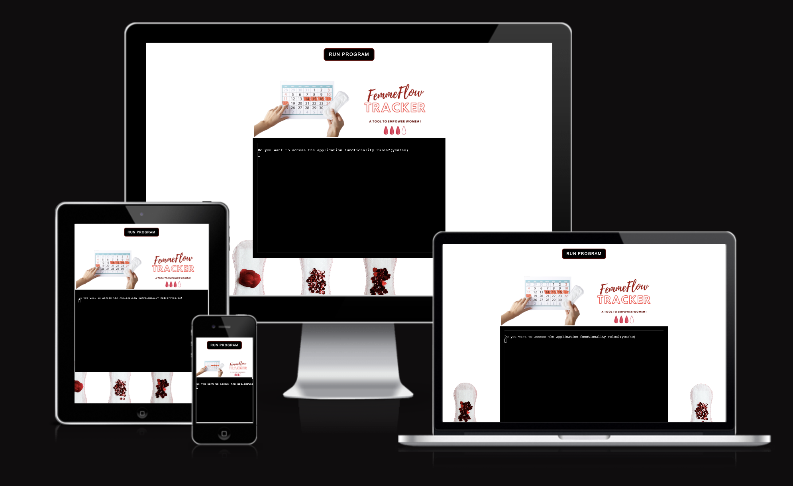
[Am I responsive?](https://ui.dev/amiresponsive?url=https://femmeflow-tracker-06bab98fd82a.herokuapp.com/)

## FEATURES

Discover a range of features that provide personalized insights, health tips, and predictions, enhancing your well-being and menstrual health journey. Dive into the following capabilities that FemmeFlow Tracker offers:

### Landing Page: An Inviting Introduction

Step into the world of FemmeFlow Tracker through its captivating landing page. As you enter, you'll be greeted by a central black terminal. Atop this terminal window, a thoughtfully designed logo, crafted using Canva Premium, proudly presents the iconic FemmeFlow Tracker emblem. Just above the logo, a beckoning "Run Program" button entices you to embark on your journey.

Beneath the terminal, a white background image takes shape, portraying a tasteful arrangement of menstrual pads. This image, meticulously created using Canva Premium, seamlessly weaves into the application's theme, echoing the essence of menstrual health and comfort. With every element thoughtfully orchestrated, the landing page encapsulates the spirit of FemmeFlow Tracker – user-friendly, empowering, and attuned to your well-being.

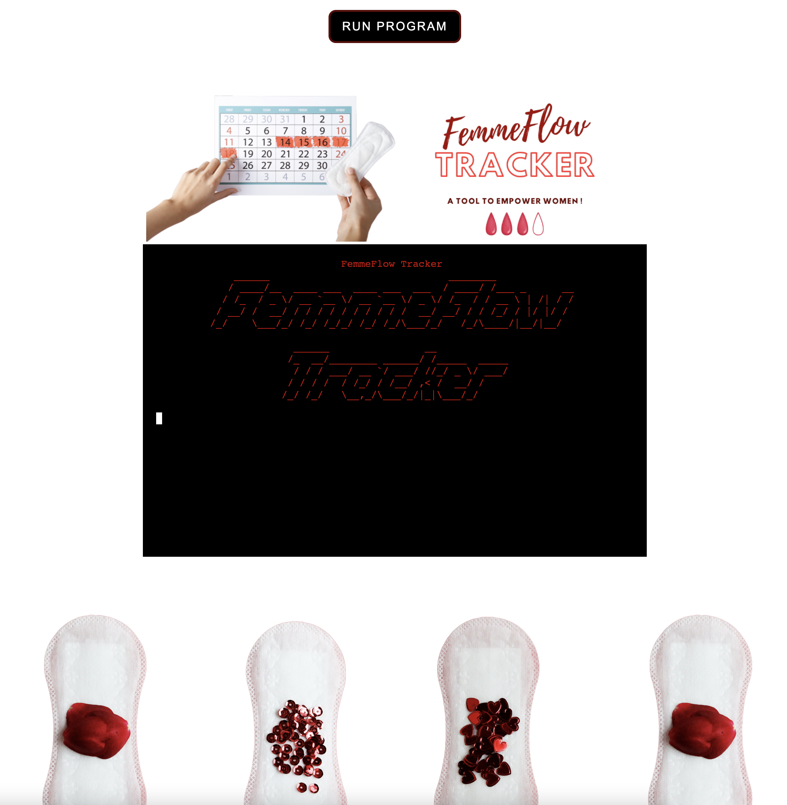

### APPLICATION INTRODUCTION

The `introduction()` function serves as the initial interaction point between the user and the FemmeFlow Tracker application. Its purpose is to provide a warm and informative welcome to the user, setting the stage for their interaction with the application's features. Here's a breakdown of the introductory features:

#### Displaying application Name with animation

- The function begins by invoking the `display_name()` function, which presents the application name "FemmeFlow Tracker" in ASCII art with an animation effect. 
- The `display_name()` function begins by defining the application name as "FemmeFlow Tracker" and generating the corresponding ASCII art using the "slant" font style from the pyfiglet library. To ensure the presentation's elegance, the function dynamically calculates the terminal width to center-align the text.

#### Access Application Functionality Rules

- After displaying the application name, the user is prompted with a choice to access the application's functionality rules. 
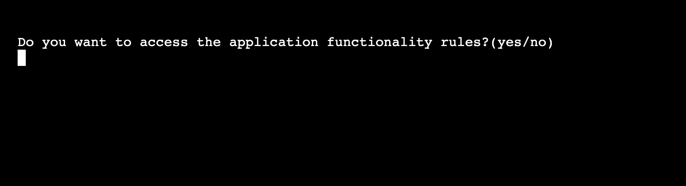

- If the user chooses to access the rules **("yes" input)**, the function clears the screen, and the `display_application_rules()` function is called to present the user with a clear understanding of how the application works. After the user is done with the rules they can press enter and they will be redirected to the welcoming message.
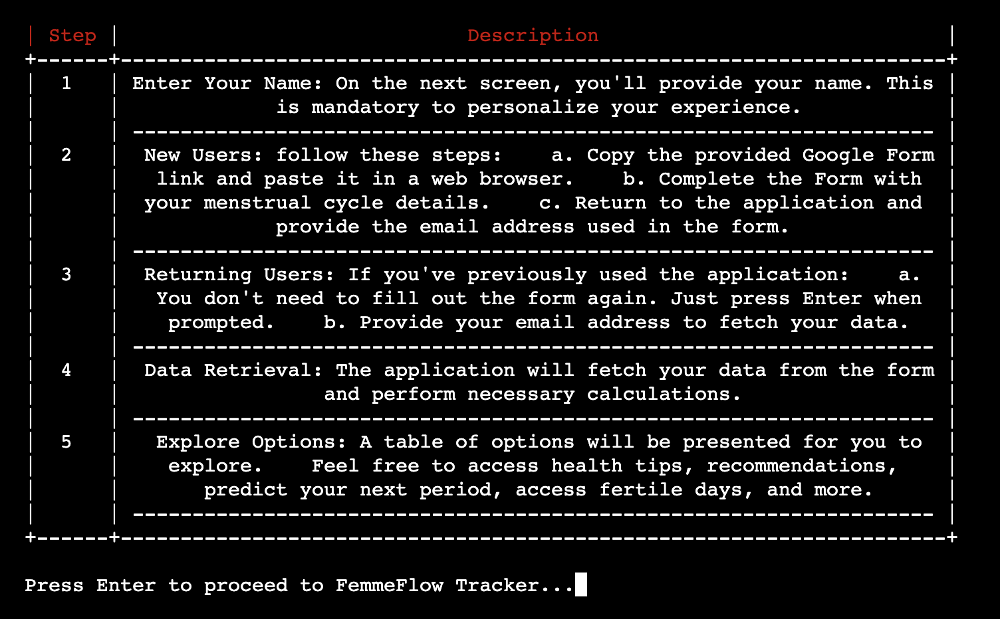

- If the user chooses not to access the rules **("no" input)**, the function clears the screen, and the application will them display the welcoming message. 

### WELCOMING PAGE AND USER'S NAME PROMPT

- Following the display of the rules or if the user chooses not to access them, the function clears the screen again and proceeds to display a detailed welcome message and description of the FemmeFlow Tracker application's purpose. 
- This description highlights the application's capabilities, such as tracking the menstrual cycle, predicting the next period date, offering personalized recommendations, and providing health tips.
- The user is then prompted to enter their name. Input validation ensures that a non-empty name is provided before proceeding. This step adds a personalized touch to the user's experience and prepares the application to address them by name. 
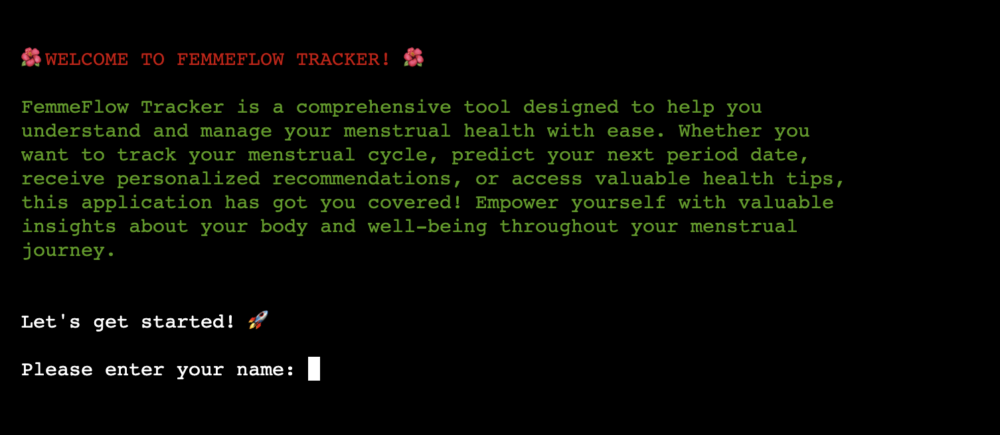
- After obtaining the user's name, the function clears the screen one final time and prepares for further interaction. This sets the stage for the user to engage with the application's features, armed with knowledge about its purpose and functionality.
- Throughout the function's execution, animation effects and color highlighting (using the Fore class from the colorama library) enhance the visual appeal and readability of the messages presented to the user.

By guiding the user through a visually engaging and informative introduction, the `introduction()` function establishes a welcoming and user-centric environment, encouraging users to explore the various features FemmeFlow Tracker has to offer.

### ESSENTIAL INFORMATION GATHERING DISCLAIMER

The `display_prompt_message()` function and the subsequent user interaction steps collectively contribute to guiding the user through the process of providing essential information to utilize the FemmeFlow Tracker application. Here's a breakdown of this feature:

- **Display Prompt Message:** The `display_prompt_message()` function is responsible for presenting the user with a prompt message that informs them about the requirement to complete a form with essential information to use the application. The message emphasizes the importance of user input for optimal functionality. The message is visually enhanced by wrapping the text and displaying it in red using color formatting from the `colorama` library. The text is also animated for added visual interest.

- **User Interaction - Initial Prompt:** After displaying the prompt message, the application prompts the user with a question: `"Would you like to continue? (yes/no)"` This gives the user the choice to proceed with providing the necessary information or to opt out. The user's response is captured, and the screen is cleared for clarity.
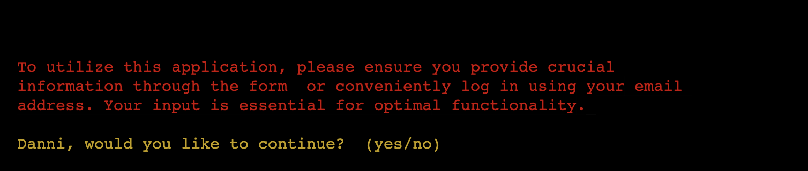

- **User Response Validation:** The user's response is then validated to ensure it matches either "yes" or "no." If the response is invalid, an error message is displayed in red, prompting the user to enter a valid response.

- **User's Decision - Proceed (Yes):** If the user's response is "yes," the `open_google_form()` function is invoked to facilitate the opening of the Google Form where the user can submit their data. The application then prompts the user to press Enter once they have submitted the data in the Google Form and are ready to proceed.

- **User's Decision - Do Not Proceed (No):** If the user's response is "no," the application informs the user that data submission is required for FemmeFlow Tracker to work effectively. The user is given the option to reconsider and proceed by submitting data in the Google Form.
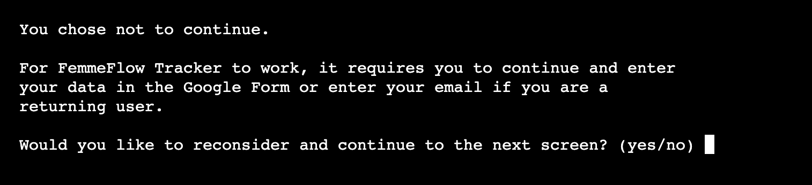

- **User Reconsideration - Proceed (Yes):** If the user chooses to reconsider and proceed ("yes"), the `open_google_form()` function is called again to open the Google Form. The user is prompted to press Enter once they have submitted the data in the form.

- **User Reconsideration - Do Not Proceed (No):** If the user chooses not to proceed ("no"), a farewell message is displayed, addressing the user by name. The message expresses gratitude for accessing FemmeFlow Tracker and encourages the user to return if they change their mind. The application then gracefully exits.
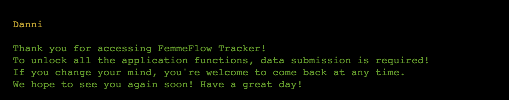

This feature of the application focuses on user engagement and decision-making, ensuring that the user is informed about the data submission process and has the opportunity to make a choice that aligns with their preferences. The application's clear messaging and well-structured interactions enhance the user experience.

### OPEN GOOGLE FORM PAGE

The `open_google_form()` function is responsible for facilitating the process of opening a specified Google Form URL in the user's default web browser. This feature allows users, whether new or returning, to enter their information into the Google Form, which is a crucial step for utilizing the FemmeFlow Tracker application. Here's a breakdown of this feature:

- **Open Google Form URL:** The function starts by specifying the URL of the Google Form (`form_url`). This URL is the location where users can input their information. [FemmeFlow tracker Google Form](https://forms.gle/BmqAMvNzfy4sn7YU8). Without filling in the form, the user cannot access the main features of this application.

- **Display Google Form Information:** The function then displays a header indicating that it is related to the Google Form, followed by an animated green text that provides instructions to new users. 

- **Display Form URL:** The function prompts the user to copy and paste the form URL into their browser. The form URL is displayed in blue with an underline, making it visually distinct. The user is guided to the URL through colored and styled text.

- **Instructions for Returning Users:** The function proceeds to display a section for returning users. It communicates that returning users can save time by simply pressing 'Enter' and providing their previously used email address. This option allows them to skip the form if they have previously filled it out.

- **Prompt to Access Data:** The function concludes by informing the user that after entering their information into the Google Form, they can return to the application to access their data and utilize all the features it offers.

Overall, this feature provides clear instructions and guidance to users on how to access and interact with the Google Form, whether they are new users who need to fill out the form or returning users who can bypass it using their email address. The user-friendly presentation of information, coupled with color-coded text and animation, enhances the user experience and ensures that users understand the necessary steps to proceed within the application.

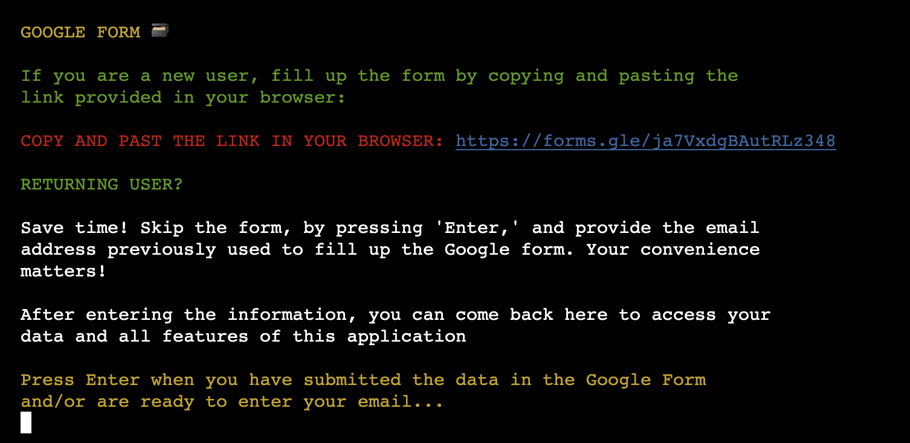

### EMAIL COLECTION AND VALIDATION

The `get_user_email()` function handles the process of collecting and validating the user's email address, which is used to match the email address they provided in the Google Form. This feature ensures that the user is properly identified and can access their data and the application's features. Here's an explanation of this function's behavior:

- **Display Prompt and User Name:** The function starts by addressing the user by their name in yellow.

- **Prompt for Email Address:** It prompts the user to enter the email address they used to fill out the Google Form. The purpose of this input is to verify the user's identity.

- **Input and Validation:** The user enters their email address, which is stored in the `user_email` variable. The input is converted to lowercase to ensure consistency during comparison.

- **Invalid Email Handling:** If the user does not provide a valid email address (i.e., an empty input), an error message is animated in red using the `animate_text()` function. This informs the user that a valid email address is required.

- **Loop for Valid Input:** The function continues to prompt the user for input until a valid email address is provided. This loop ensures that the user cannot proceed until a valid email address is entered.

- **Return Valid Email:** Once a valid email address is entered, the function returns the validated email address.

Overall, this feature ensures that the user's email address is collected accurately and matches the one they used in the Google Form. By collecting this information, the application can associate the user with their data and provide them with personalized access to its features. The use of colored text and input validation helps guide the user through the process and ensures that the correct information is obtained for successful interaction with the application.

### FETCH USER DATA

The `fetch_user_data` function is responsible for retrieving and processing user data from a Google Sheets response worksheet based on the provided email address. The function performs the following steps:

- **Find Rows with Matching Email:** The function searches for all rows in the Google Sheets response worksheet that match the provided email address. It identifies the cells containing the email and determines the corresponding row numbers.

- **Retrieve User Data:** The function retrieves the data from the identified rows in the worksheet. Each row represents a user response, and the function gathers all relevant data from these rows.

- **Filter Invalid Data:** The retrieved user data may contain incomplete or invalid entries. The function filters out any rows with data that do not match the expected number of columns, ensuring that only valid responses are considered.

- **Sort by Timestamp:** The valid user data is sorted by timestamp in descending order. This arrangement ensures that the latest response is at the top of the list, making it the most recent entry.

- **Return Processed Data:** The function returns the processed and sorted user data as a list of lists, where each inner list represents a user response entry. If no valid data is found for the provided email address, the function returns `None`.

The `fetch_user_data` function plays a crucial role in retrieving and preparing user responses for further processing and analysis within the FemmeFlow Tracker application. It ensures that only valid and relevant data are considered while providing a mechanism to access the most recent user responses based on the timestamp.

### OPTIONS TABLE

#### Table Overview

The `print_options()` function is responsible for displaying a table of available options that the user can choose from within the FemmeFlow Tracker application. It provides a clear and user-friendly interface for the user to make selections. Here's how this function works:

- **Initializing Colorama:** The function starts by initializing Colorama to ensure that text color changes are handled correctly.

- **Print Description:** A description is printed, guiding the user on how to make a selection by entering the corresponding number.

- **Table Creation:** The function uses the PrettyTable library to create a table with two columns: "Option" and "Description." Each row in the table represents an available option in the application, and the table includes the following options:

   - Health Tips
   - Form Submission Data
   - Fertile Days
   - Next Period Date
   - Personalized Recommendations
   - Exercises Tips
   - Application Rules
   - Quit the application
    
- **Setting Table Color:** The table text is colored in red using Colorama, creating a visually distinctive and attention-grabbing display for the user.

- **Print Table:** The colored table is printed to the console, presenting the available options and their corresponding descriptions to the user.

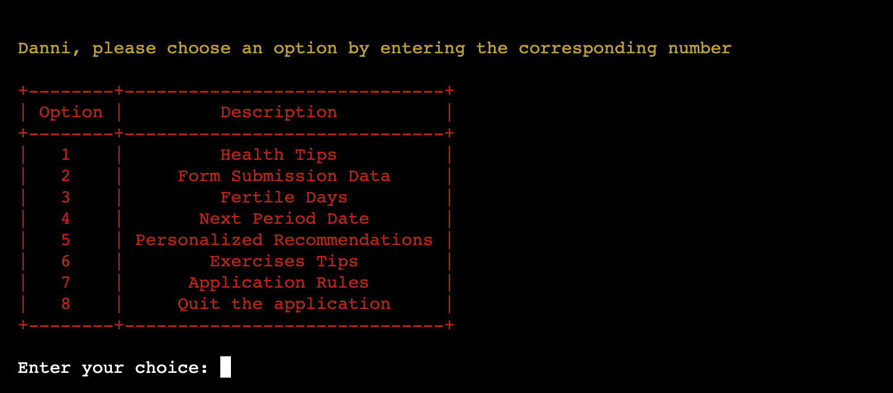

Overall, the `print_options()` function contributes to the user-friendly and interactive nature of the FemmeFlow Tracker application. It provides a structured presentation of the available features, making it easy for users to select the functionality they wish to access. The use of colors and a well-formatted table enhances the visual appeal and usability of the application's interface.

#### TABLE OPTION 1 - Health tips

The `display_health_tips` function is responsible for providing users with valuable health tips to effectively manage their menstrual cycle. This feature is designed to improve users' well-being and make their periods more manageable. The function operates as follows:

- **Display Title and Introduction:** The function displays the title "HEALTH TIPS 🌟" in yellow text, indicating that health tips are being presented. An introduction is also displayed, explaining the importance of taking care of one's health during the menstrual cycle and encouraging users to follow the provided tips.
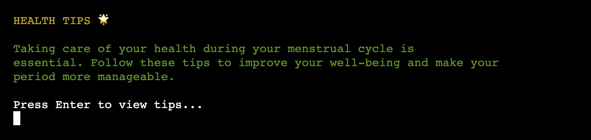

- **Prompt for Viewing Tips:** Users are prompted to press Enter to view the health tips. This prompt allows users to proceed at their own pace.

- **Display Regular Cycle Tips:** The function presents a table of health tips for individuals with regular menstrual cycles. Each tip is assigned a number, and the tips are provided in a well-formatted table with two columns: "Tip Number" and "Tip Text." Tips cover various aspects of health, including diet, exercise, stress management, and more.
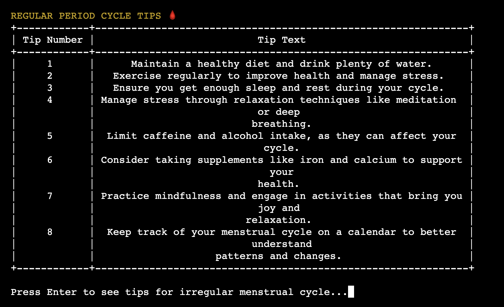

- **Display Irregular Cycle Tips:** If the user's cycle is irregular, the function allows users to press Enter to see additional health tips specific to irregular menstrual cycles. A separate table is displayed for these irregular tips. This ensures that users with irregular cycles receive targeted advice to address their specific concerns.
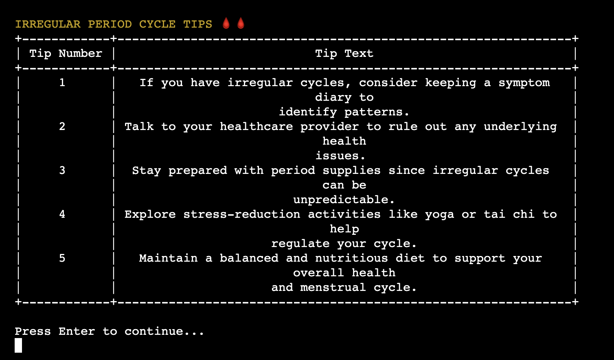

- **Continue or Proceed:** After displaying both regular and irregular tips, users are prompted to press Enter to continue. This prompt ensures that users have enough time to read and absorb the provided information.

Overall, the `display_health_tips` function enhances the user's knowledge about maintaining good health during the menstrual cycle by offering practical and tailored advice. The function utilizes formatting and prompts to ensure that users can access and understand the tips easily, promoting a positive and informed menstrual health journey.

#### TABLE OPTION 2 - Form Submission Data

The `update_data` function allows users to update their menstrual cycle data through the terminal. This feature provides users with the flexibility to correct or modify their details as needed. The function operates as follows:

- **Header and Acknowledgment:** This part serves as an acknowledgment of the user's data submission and emphasizes the importance of the provided information. It underscores how tracking their menstrual cycle can lead to better insights and well-being management.
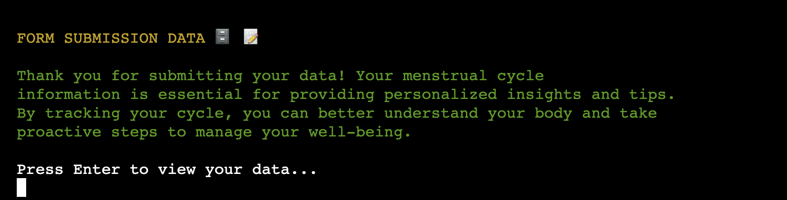

- **Google Form Submited Data:** A formatted table displays the submitted user data, including the name, age, email, last period date, cycle length, period duration, cycle type, and symptoms. Each row represents a specific field, and the corresponding value is provided in the adjacent column.

- **Update Option and Disclaimer** An question prompts the user to consider whether they need to update their details. It indicates that the option to update is available if there are any inaccuracies or changes since their last access. The disclaimer emphasizes the importance of updating data only if necessary. It provides a cautionary note that data should be modified only in cases of inaccuracies or changes since the user's last access.
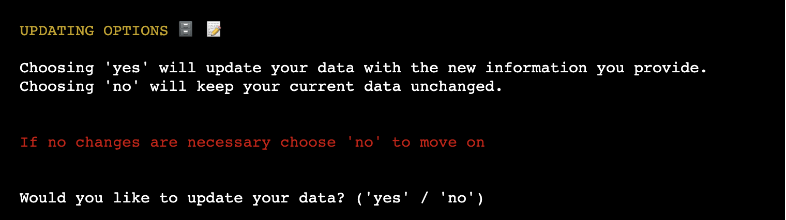

- **Display Title and Introduction:** The function displays the title "UPDATE DATA 🗃" in yellow text, indicating that the user's data can be updated. An introduction is provided, guiding the user through the process of updating their menstrual cycle data. The user is informed that their name and age cannot be updated.

- **Get Updated Last Period Date:** The function prompts the user to input an updated last period date. The current last period date is displayed in the prompt. If the user chooses to skip updating this field or enters an empty value, the function informs the user that the last period date was not updated. If a valid date is entered, the function updates the global `last_period` variable.

- **Get Updated Cycle Length:** The user is prompted to input an updated cycle length. If the user chooses to skip updating this field, the function proceeds. Otherwise, it attempts to convert the input to an integer and updates the global `cycle_length` variable if the input is valid.

- **Get Updated Period Duration:** Similar to the cycle length, the user is prompted to input an updated period duration. If the user chooses to skip updating this field, the function proceeds. If the input is valid, the global `period_duration` variable is updated.

- **Get Updated Cycle Type:** The user is prompted to update their cycle type. They can choose from options such as "regular," "irregular," or "skip." If a valid option is chosen (other than "skip"), the global `cycle_type` variable is updated.
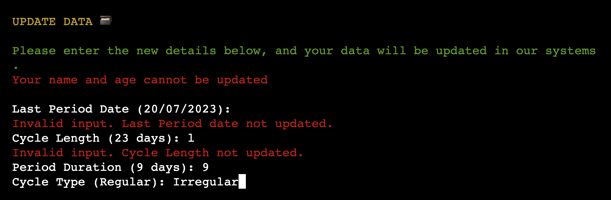

- **Get Updated Symptoms:** The function displays a list of available symptoms in a table-like format. The user is prompted to enter updated symptoms separated by commas. The input is converted to lowercase for case-insensitive comparison. If valid symptoms are provided, the global `symptoms` variable is updated.
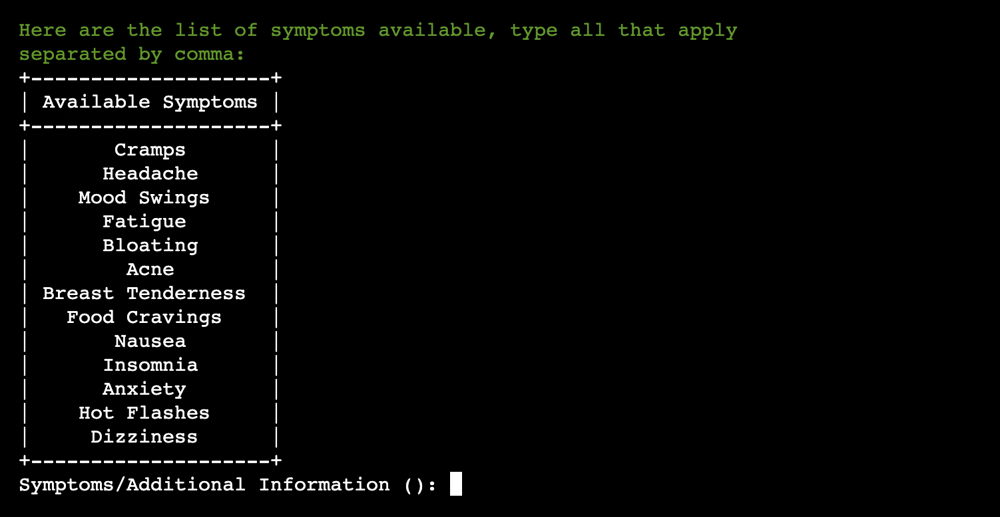

- **Processing and Data Update:** After collecting the updated information, the function displays a processing animation to indicate that the data is being updated. The Google Sheets are then updated with the new data using the `update_google_sheets` function.

- **Success Message:** Once the update is complete, the function displays a success message in green text to inform the user that their data has been updated successfully.

The `update_data` function provides users with a user-friendly way to modify their menstrual cycle data, ensuring that the application's information remains accurate and up-to-date.

#### Updating Google Sheets 

The `update_google_sheets` function is responsible for updating user data in the Google Sheets document based on the changes edited in the terminal. This function plays a crucial role in maintaining accurate and up-to-date records of users' menstrual cycle data. 
Here's how the function works:

- **Function Signature:** The function `update_google_sheets` takes several parameters: `email`, `last_period`, `cycle_length`, `period_duration`, `cycle_type`, and `symptoms`. These parameters represent the updated data that needs to be stored in the Google Sheets document.

- **Finding Matching Rows:** The function begins by searching for all rows in the Google Sheets document where the email address matches the provided `email`. It uses the `findall` method to locate all cells containing the specified email.

- **Extracting Rows:** For each cell containing the email address, the function extracts the corresponding row number. This ensures that all rows associated with the user's email address are identified.

- **Updating Rows:** The function then iterates over the set of row numbers obtained in the previous step. For each row, it uses the `update_cell` method to modify specific columns within that row. The columns updated include the last period date, cycle length, period duration, cycle type, and symptoms. The updated values are taken from the provided parameters.

- **Updating Google Sheets:** The function essentially applies the changes to each identified row, ensuring that the user's data is accurately updated in the Google Sheets document.

By utilizing the `update_google_sheets` function, the application maintains a synchronized and consistent dataset in the Google Sheets document, reflecting the most recent information about users' menstrual cycle data. This process is vital for ensuring that users receive accurate insights, recommendations, and predictions based on their updated details.

#### TABLE OPTION 3 - Fertile Days

The `display_fertile_days` function serves the purpose of presenting projected fertile days for the next 6 months to users. This feature is particularly useful for individuals who are planning a pregnancy or seeking to understand their potential conception periods. Here's an overview of how the function works:

- **Header and Description:** The function begins by displaying a header and description of the fertile days feature. The description underscores the importance of knowing fertile days for pregnancy planning and awareness. The text is formatted in YELLOW to draw attention.

- **Table Creation and Population:** The function creates a table using the `PrettyTable` library with three columns: Month, Fertile Start Date, and Fertile End Date. It then enters a loop that iterates six times to populate the table with projected fertile days for each of the next six months.

- **Table Content:** In each iteration of the loop, the function adds a row to the table with the following information:
   - Month: The full name of the month and the corresponding year.
   - Fertile Start Date: The start date of the fertile period for that month.
   - Fertile End Date: The end date of the fertile period for that month.

   The fertile start and end dates are incremented by 28 days in each iteration, which roughly corresponds to the length of a menstrual cycle.

- **Table Display:** Once the table is populated, the function prints the table to the terminal. The table neatly organizes and displays the projected fertile days for the next 6 months. 

In summary, the `display_fertile_days` function offers a user-friendly and informative presentation of projected fertile days over the next 6 months. This feature empowers users with valuable insights into their fertility windows, supporting their family planning and conception-related decisions.

### TABLE OPTION 4 - Fertile Days

The `display_next_period_date` function offers users insights into their predicted next period dates for the upcoming six months. This feature is designed to aid individuals in tracking their menstrual cycle, whether for reproductive health awareness or planning purposes. Here's a breakdown of how the function operates:

- **Header and Description:** The function commences by displaying a header and a comprehensive description of the upcoming period dates feature. This description emphasizes the importance of menstrual cycle tracking for reproductive health understanding, while also addressing the purpose of the projected period dates. The text is presented in YELLOW for visibility.

- **Table Creation and Filling:** A table is generated using the `PrettyTable` library, featuring two columns: Month and Next Period Date. The function then enters a loop that iterates six times to populate the table with predicted next period dates for each of the next six months.

- **Table Content:** In each iteration of the loop, the function appends a row to the table with the following data:
   - Month: The full name of the month along with the corresponding year.
   - Next Period Date: The projected start date of the next menstrual period for that month.

   The `next_period` date is increased by 28 days in each iteration, approximating the length of a typical menstrual cycle.

- **Table Display:** Once the table is populated, the function prints the table to the terminal. The table format effectively organizes and presents the forecasted next period dates for the forthcoming six months. This information is beneficial for users aiming to plan their schedules or be prepared for upcoming menstrual cycles.

In summary, the `display_next_period_date` function provides users with a visually appealing and informative overview of their anticipated next period dates over the upcoming six months. 
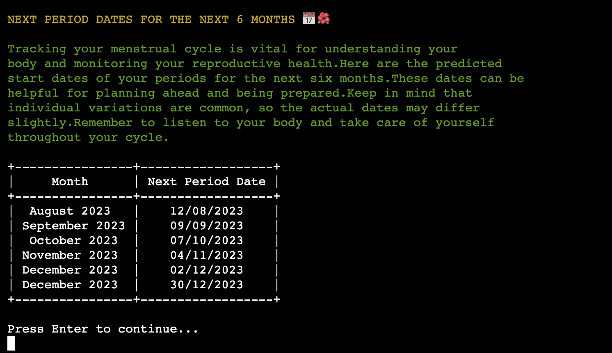

### TABLE OPTION 5 - Personalized Recommendations

The three functions presented bellow work together to calculate important menstrual cycle dates, display personalized recommendations for specific symptoms, and provide tailored advice to users based on their cycle data and symptoms.

#### CALCULATE_DATES_AND_RECOMENDATIONS FUNCTION

The `calculate_dates_and_recommendations` function calculates important dates for the user's menstrual cycle and invokes the `personalized_recommendations` function to generate personalized recommendations. Here's a description of how it works:

- **Calculation of Dates:** The function calculates the next period date, fertile days' start and end dates based on the user's last period date and cycle length. The calculated dates are stored in global variables (`next_period`, `fertile_start`, `fertile_end`).

- **Invoking Personalized Recommendations:** The function calls the `personalized_recommendations` function with `cycle_length`, `period_duration`, and `symptoms` as arguments to generate personalized recommendations.

---

#### DISPLAY_RECOMMENDATIONS_TABLE FUNCTION

The `display_recommendations_table` function is responsible for displaying personalized recommendations for dealing with a specific symptom. Here's an overview:

- **Display Recommendations:** The function displays a header in RED, indicating the specific symptom for which recommendations are being displayed. It then creates a table using the PrettyTable library to present the recommendations in a structured format.

---

#### PERSONALIZED_RECOMMENDATIONS FUNCTION

The `personalized_recommendations` function generates personalized recommendations based on menstrual cycle data, addressing symptoms and offering advice. Here's an overview of how it works:

- **Introduction and User Interaction:** The function displays a header in YELLOW and an introductory message. Users are prompted to press Enter to continue.
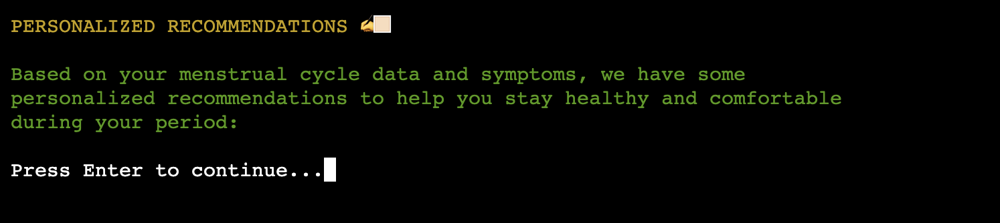

- **Cycle Length Advice:** Advice is provided if the user's cycle length is less than 28 days. The advice is displayed in a formatted table.

- **Period Duration Advice:** Advice is provided if the user's period duration is greater than 7 days. The advice is displayed in a similar table format.
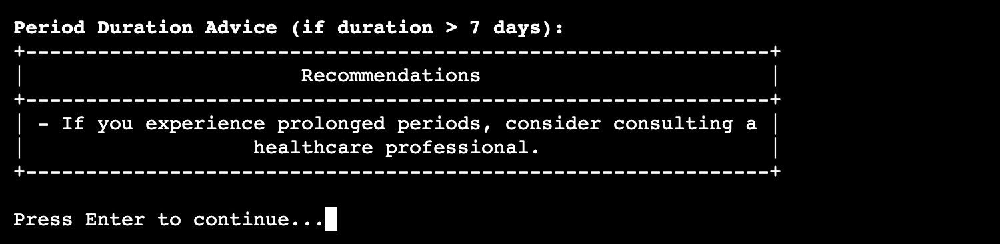

- **Short Period Advice:** Advice is given if the user's period duration is less than 3 days. The advice is displayed in a formatted table.
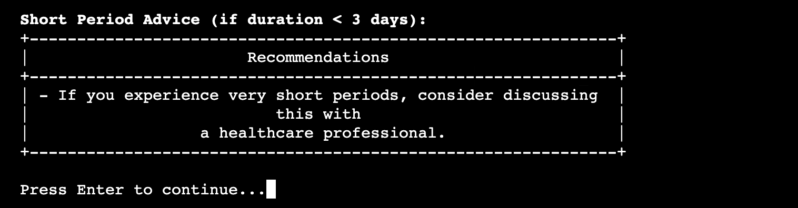

- **Symptom-Specific Recommendations:** Personalized recommendations are defined in a dictionary named `recommendations`. The function filters symptoms based on the user's input and displays recommendations for each selected symptom. Recommendations are presented in formatted tables.
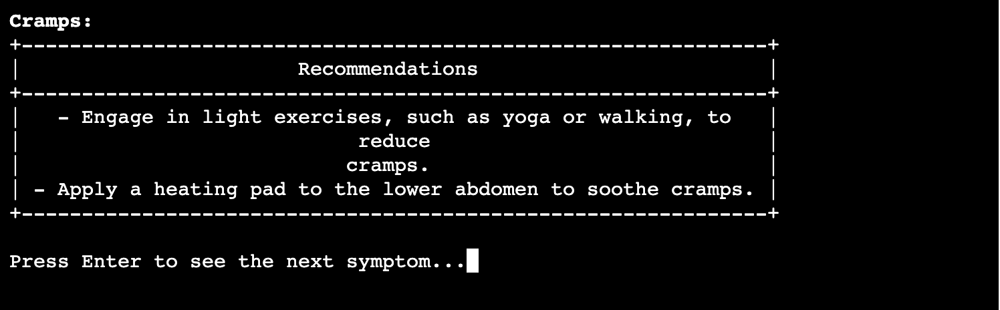

- **Advisory Message:** After all recommendations are displayed, an advisory message is shown in RED, emphasizing that the recommendations provide general guidance and encouraging users to seek personalized advice from healthcare professionals.

In summary, this comprehensive approach supports users in managing their well-being during their menstrual cycle.

### TABLE OPTION 6 - Exercises Tips

The `display_exercises_tips` function provides exercise recommendations to help reduce menstrual cramps, improve mood, and promote overall well-being during the menstrual cycle. It displays two separate tables: one for cramp-reducing exercises and another for mood-improving exercises. Here's how the function works:

- **Introduction and User Interaction:** The function displays a header in YELLOW and an introductory message about the benefits of regular physical activity during the menstrual cycle. Users are prompted to press Enter to continue.

- **List of Exercises:** The function defines two separate lists: `cramp_exercises` and `mood_exercises`, which contain exercise recommendations for reducing cramps and improving mood, respectively.

- **Creating Tables:** Two separate PrettyTable objects are created: `cramp_table` for cramp-reducing exercises and `mood_table` for mood-improving exercises. The exercise recommendations are added to the tables along with corresponding numbering.

- **Formatted Table Strings:** The tables are converted to formatted string representations using the `get_string` method.

- **Displaying Tables Side by Side:** The formatted table strings are split into lines, and the corresponding lines from both tables are printed side by side to display the exercise recommendations for cramp reduction and mood improvement together.

In summary, the `display_exercises_tips` function provides users with exercise recommendations that can help alleviate discomfort and improve mood during their menstrual cycle. The function's organized presentation of exercise options contributes to users' well-being and provides them with practical strategies for managing their menstrual symptoms.
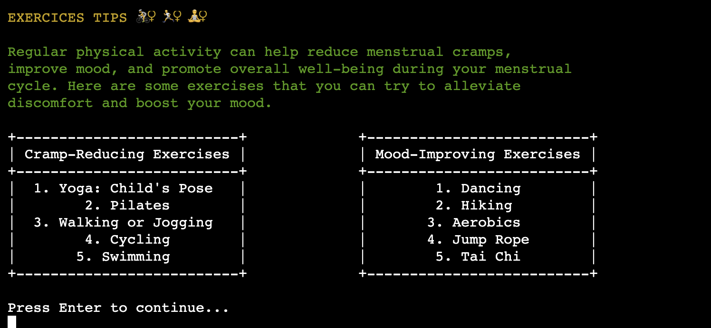

### TABLE OPTION 7 - Application Rules

- Choosing option 7 allows the user to view the rules and functionality of the FemmeFlow Tracker application again. 
- This feature provides information about how the application works, its features, and any specific guidelines users should follow. 
- The user is presented with an overview of the application's rules without having to input any additional message.

In summary, option 7 provides a quick way for users to access information about the application's functionality
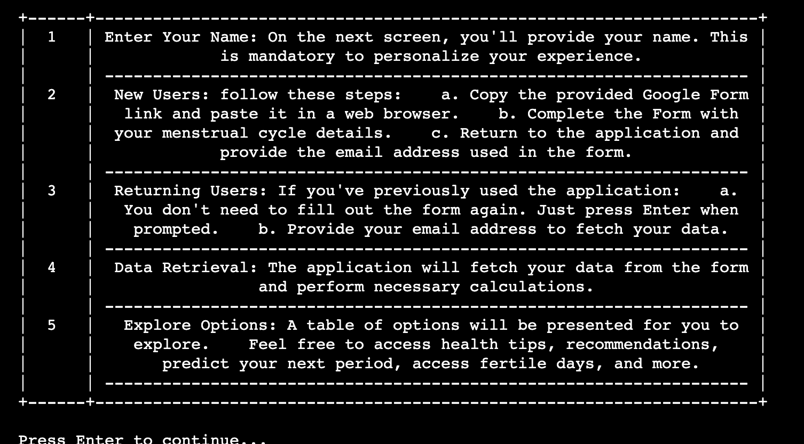

### TABLE OPTION 8 - Exit the Application

- The user's name (retrieved from the `user_name` variable) is displayed in yellow.
- A thank you message is displayed in green, expressing gratitude for using the FemmeFlow Tracker.
- The application informs the user that they can return and use the application again in the future.
- The application loop is exited, and the program terminates.

In summary, option 8 allows users to gracefully exit the application with a friendly farewell message.

