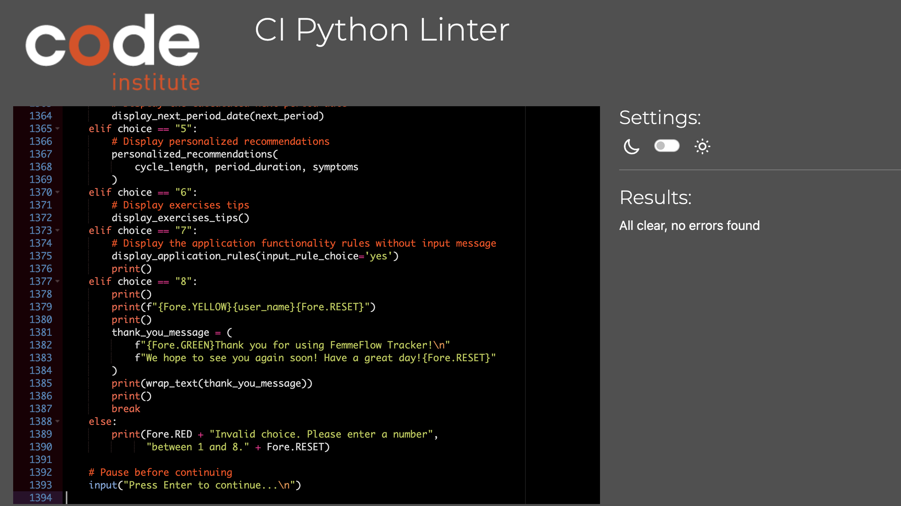

## TESTING

### CI PYTHON LINTER VALIDATOR
---
Python code has been tested and validated with CI Python Linter and no errors were found.

### BUGS
---

- **Bug in Application Functionality:**
  - The code was functioning seamlessly until around 1 hour ago as you can verify by the construction of the README.md file.
  - Suddenly, a modification occurred in the Google Form, affecting the formatting and order of events in the associated Google Sheets.
  - As a result, the code is no longer able to retrieve user email and data as expected.
  
- **Frustration and Apology:**
  - I am genuinely frustrated and sorry to report this unforeseen issue.
  - Unfortunately, due to time constraints, I am unable to locate and fix the issue promptly as the project submission deadline is only 3 hours away and I need to work in 30 minutes.
  - I apologize for the inconvenience this may cause and any disruption to the intended user experience.

- **Current State of the Application:**
  - As of now, the application functionalities halt after users input their email addresses.
  - The bug prevents the app from proceeding to fetch user data, which was previously working flawlessly.

- **User Interaction and Form Filling:**
  - Users can still access and complete the Google Form.
  - Regrettably, due to the existing bug, the application is unable to progress beyond the email input stage.
  
- **Upcoming Steps:**
  - I am committed to resolving this issue and restoring the application's seamless functionality.
  - After submission, I will dedicate time to locate and address the bug and hopefully have the time to submit it again.

Thank you for your understanding and patience as I work to rectify this unexpected setback. 

[BACK TO README 🔼 ](README.md)